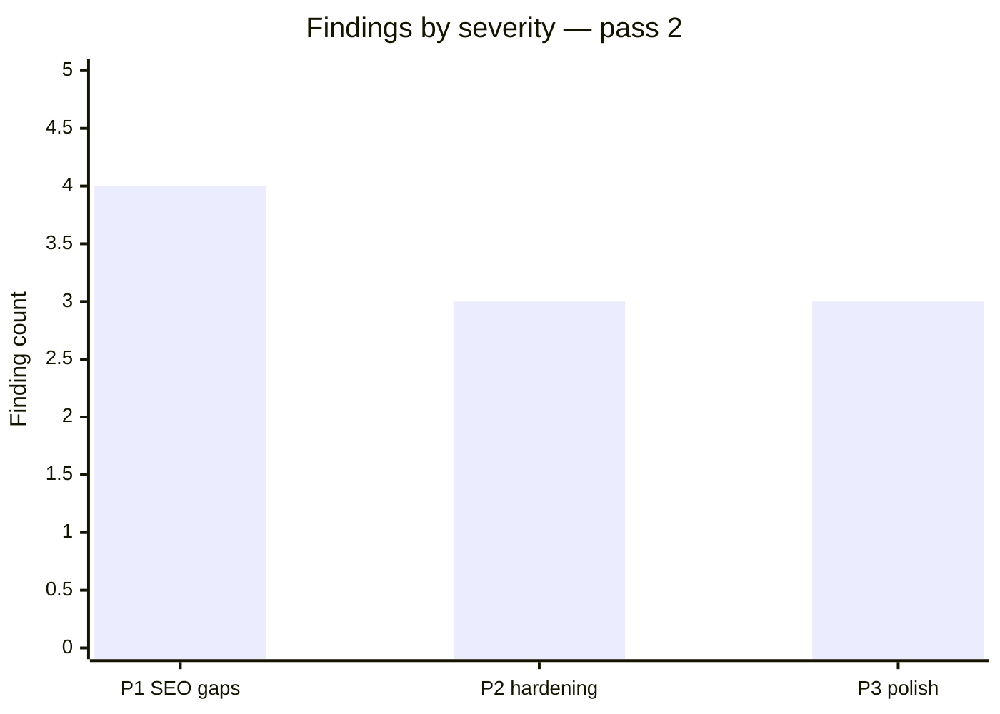
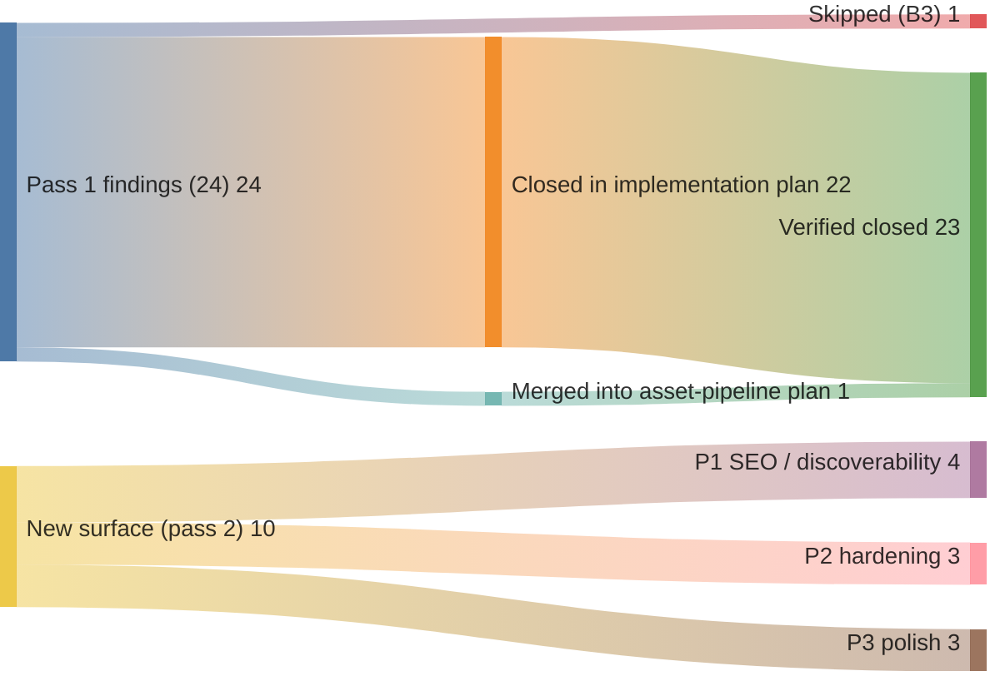

# Code review — indri.studio (pass 2, 2026-05-14)

## Finding summary





Second pass over the indri.studio codebase, starting from HEAD `3162105` ("Verify html-cache-no-store plan; document _headers regression"). Scope: same as [pass 1](2026-05-14-code-review.md) — `src/`, `worker/`, `infrastructure/`, `scripts/`, `.github/`, top-level config. Prior findings already closed in the [implementation plan](../plans/2026-05-14-code-review-implementation.md) are not re-examined unless the fix introduced a new issue.

**Context**: pass 1 closed 22 of 24 findings. B3 (store-badge `#` placeholders) was intentionally skipped; H3/H4 were closed via the [asset-pipeline plan](../plans/2026-05-14-asset-pipeline-cache-busting.md). This pass looks for what landed since then and runs fresh eyes over the remaining surface.

---

## P1 — SEO and discoverability gaps

### D1. No Open Graph or Twitter Card meta tags

[`src/layouts/Base.astro`](../../src/layouts/Base.astro) emits `<meta name="description">` and `<title>` but no OG or Twitter card tags. Sharing any page on social media (Slack, Twitter/X, LinkedIn, iMessage) produces a plain-text link — no image card, no subtitle, no brand presence.

Minimum set to add in `Base.astro` (accepting `ogImage?: string` and `ogType?: string` as Props):

```astro
<meta property="og:title" content={fullTitle} />
<meta property="og:description" content={description} />
<meta property="og:type" content={ogType ?? "website"} />
<meta property="og:url" content={Astro.url.href} />
{ogImage && <meta property="og:image" content={ogImage} />}
<meta name="twitter:card" content={ogImage ? "summary_large_image" : "summary"} />
```

A static `/img/og-default.png` (1200×630) covers the studio pages; per-app pages can pass their first screenshot as `ogImage` from the frontmatter. This is one of the highest-ROI additions for a portfolio site.

### D2. No `<link rel="canonical">` tag

`Base.astro` doesn't emit a canonical URL. While the Worker correctly 301s `www.indri.studio` to `indri.studio`, canonical tags are belt-and-suspenders: they signal intent to crawlers that see both the Workers preview URL and the prod hostname. One line in `Base.astro`:

```astro
<link rel="canonical" href={Astro.url.href.replace("www.", "")} />
```

### D3. No `robots.txt`

[`public/`](../../public/) has no `robots.txt`. The site returns 404 on `/robots.txt`. Lighthouse SEO scores 100 because it treats a clean 404 as "not malformed," but the absence means there is no machine-readable signal for search engine crawl budget or exclusion of the `public/lh/` Lighthouse archive (large JSON blobs that shouldn't be indexed). At minimum, disallow `lh/`:

```
User-agent: *
Disallow: /lh/
```

### D4. No sitemap

No `@astrojs/sitemap` integration. Astro can auto-generate a `sitemap-index.xml` covering all static routes with a one-line addition to `astro.config.mjs`. Helps search engines discover `/colophon/` and all `/apps/<slug>/` pages.

---

## P2 — Hardening

### H1. Worker sets no Content-Security-Policy

[`worker/index.ts`](../../worker/index.ts) passes through `ASSETS.fetch()` responses for non-www requests without adding security headers. The site currently loads `fonts.googleapis.com` / `fonts.gstatic.com` (Material Symbols) from some pages. Without a CSP, there is no header-level defence if a compromised package adds an inline script or unexpected resource.

Minimal permissive CSP to add in the Worker for HTML responses:

```ts
headers.set(
  "Content-Security-Policy",
  "default-src 'self'; " +
  "font-src 'self' fonts.gstatic.com; " +
  "style-src 'self' 'unsafe-inline' fonts.googleapis.com; " +
  "script-src 'self' 'unsafe-inline'; " +
  "img-src 'self' data:"
);
```

`'unsafe-inline'` is needed because Astro inlines stylesheets (`build.inlineStylesheets: "always"`) and the inline `<script is:inline>` in `Base.astro`. A stricter nonce-based policy would require Astro integration that doesn't exist yet; this permissive version still blocks obvious third-party script injection.

### H2. Lighthouse archive JSON files served without cache headers

[`public/lh/`](../../public/lh/) holds per-tag Lighthouse JSON reports. The `_headers` file has no rule for `/lh/*`, so Workers Static Assets uses its platform default (typically `Cache-Control: public, max-age=14400`). These JSONs are immutable once written (a tag's audit data never changes); they could be served with `max-age=31536000, immutable` like `/_astro/*`. Alternatively, exclude them from the site entirely — they're large (multiple MB per tag), and direct JSON access has limited user value. Consider redirecting `/lh/` to the GitHub Actions artifact download page or simply not committing future bundles to `public/`.

### H3. `img/cca-styles/*` content may drift from cache

[`public/_headers:34–36`](../../public/_headers):

```
/img/cca-styles/*
  Cache-Control: public, max-age=86400, stale-while-revalidate=604800
```

The comment explains these are referenced via JS-built template literals so they can't be hashed. Workers Static Assets is documented to strip `stale-while-revalidate` on some plan tiers. If SWR is stripped, clients hold the old image for `max-age` (1 day) after a replacement is deployed. This is acceptable in practice — style images change infrequently — but add a note to [docs/DEPLOY.md](../DEPLOY.md) to run `task publish` (not just `task deploy`) after updating `img/cca-styles/` so the version tag changes and any cached file list updates.

---

## P3 — Style and small polish

### S1. Duplicate `@keyframes lemur-idle` in two page files

[`src/pages/404.astro:99–107`](../../src/pages/404.astro) and [`src/pages/colophon.astro:461–469`](../../src/pages/colophon.astro) both define the identical `@keyframes lemur-idle` block. Astro's scoped styles keep them from conflicting, but they'll silently diverge the next time someone tweaks the animation. Extract to `@layer base` in [`src/styles/global.css`](../../src/styles/global.css) alongside the existing `prefers-reduced-motion` pattern:

```css
@layer base {
    .lemur-idle {
        transform-origin: 50% 92%;
        animation: lemur-idle 7s ease-in-out infinite;
        will-change: transform;
    }
    @keyframes lemur-idle { … }
    @media (prefers-reduced-motion: reduce) {
        .lemur-idle { animation: none; }
    }
}
```

Then remove the duplicated `<style>` blocks from both pages.

### S2. `pendingDir` cleanup window in catalogue navigation

[`src/pages/apps/[...slug].astro:175–184`](../../src/pages/apps/[...slug].astro):

```js
document.addEventListener('astro:page-load', () => {
    setTimeout(() => {
        delete document.documentElement.dataset.navDir;
        pendingDir = null;
    }, 400);
});
```

The 400ms cleanup window means a prev→next→prev sequence faster than 400ms per hop will apply the wrong slide direction on the last navigation. This is a very narrow window for real users (400ms is two taps) but observable on a slow connection where navigation queues. A safer approach is to clear `pendingDir` in the `astro:before-preparation` handler for the *next* navigation, not on a timeout after the previous one:

```js
document.addEventListener('astro:before-preparation', () => {
    // Clear the previous direction — the new navigation will set it if needed.
    if (!pendingDir) document.documentElement.dataset.navDir = '';
});
```

### S3. CI propagation wait is a fixed sleep

[`.github/workflows/deploy.yml:65`](../../.github/workflows/deploy.yml): `sleep 30` before the Lighthouse audit. Cloudflare Workers deployments typically propagate within 1–5 seconds; 30s is a conservative floor that adds 25+ seconds of unnecessary wait on every deploy. A lightweight curl poll would tighten this:

```bash
until curl -sf https://indri.studio/ -o /dev/null; do sleep 3; done
```

Cap with a timeout so a broken deploy doesn't hang CI indefinitely.

---

## What's clearly working well (incremental since pass 1)

- **S5 from pass 1 is fixed** — `scroll-mt-header` with `calc(80px - 32px * var(--header-shrink, 0))` is correctly implemented in `global.css:516` and used on all anchor sections. The dynamic scroll-margin matches the dynamic header height.
- **Worker HTML cache control** — `Cache-Control: no-store` set in the Worker (not via `_headers`) for HTML responses is the right approach. The `_headers` regression where `/*` catch-all overrode `/_astro/*` immutable is documented and fixed.
- **Self-hosted fonts + inline CSS** — the astro.config.mjs + `build.inlineStylesheets: "always"` combination eliminates all render-blocking external resources except Material Symbols (loaded async via `onload` swap).
- **Asset pipeline** — screenshots in `src/assets/` flow through Astro's image pipeline to hashed `_astro/` URLs, inheriting the 1-year immutable cache rule correctly.
- **`setup-workers-ai.sh`** — still exemplary: `umask 077`, `file://` for SSM `--value`, probe-before-push, `cleanup-stack.sh` for temp file cleanup.
- **Lighthouse CI threshold gate** — `scripts/lighthouse-threshold.sh` is clean, self-contained, and its `--help` flag and empty-reports guard are handled correctly.

---

## Recommended order of operations

1. **D1 (OG tags)** — highest-impact SEO/social improvement; pairs naturally with D2 (canonical) in one commit.
2. **D3 + D4 (robots.txt + sitemap)** — five minutes of work; ship together.
3. **H1 (CSP)** — during next Worker edit.
4. **S1 (lemur-idle dedup)** — next time either page is touched.
5. **H2 (lh/ cache headers)** — decide policy (immutable vs. exclude) before the `public/lh/` directory grows large enough to matter.
6. **S2, S3** — opportunistic.
