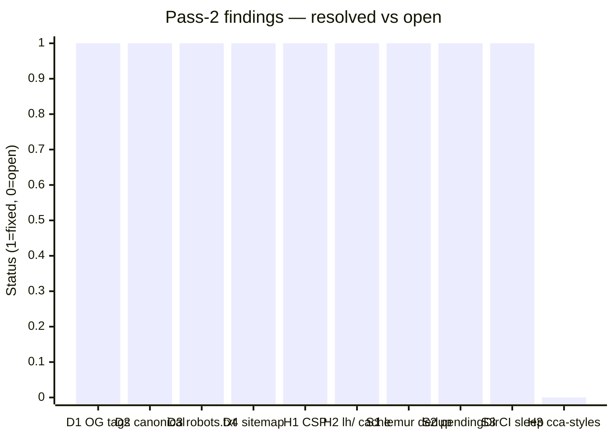
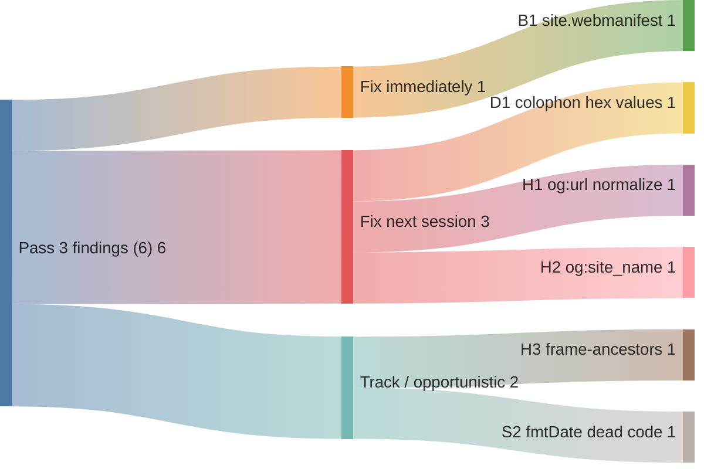

# Code review — indri.studio (pass 3, 2026-05-14)

Third pass, starting from HEAD `a35394a` ("Code review pass 2: SEO, CSP (Content Security Policy), dedup, CI polish"). Scope is the full `src/`, `worker/`, `infrastructure/`, `scripts/`, `.github/`, `public/`, top-level config — every file changed in the pass-2 implementation commit plus a fresh read of all adjacent files.

## Pass-2 scorecard



9 of 10 pass-2 findings closed. H3 (`img/cca-styles/*` SWR) was explicitly deferred and is still open. Everything else is confirmed fixed and works correctly.

---

## P1 — Bug shipped to users

### B1. `site.webmanifest` still has Rapid Raccoon branding

[`public/site.webmanifest`](../../public/site.webmanifest):

```json
{
  "name": "Rapid Raccoon",
  "short_name": "RR",
  "theme_color": "#00f2ff",
  "background_color": "#0a0e0f",
  "display": "standalone"
}
```

Every page links this via `<link rel="manifest" href="/site.webmanifest" />`. On any browser that acts on the manifest — PWA install, add-to-home-screen on iOS/Android, Chrome's app-install prompt, bookmark syncs — the installed app shows as "Rapid Raccoon" with a cyan splash screen. `theme_color` also controls the browser chrome tint on mobile; `#00f2ff` (cyan) is the rapid-raccoon brand, not `#b026ff` (Phosphor purple).

Fix:

```json
{
  "name": "indri",
  "short_name": "Indri",
  "description": "Small studio, building apps people use every day.",
  "icons": [
    { "src": "/icon-192.png", "sizes": "192x192", "type": "image/png" },
    { "src": "/icon-512.png", "sizes": "512x512", "type": "image/png" }
  ],
  "theme_color": "#b026ff",
  "background_color": "#3d3833",
  "display": "standalone",
  "start_url": "/"
}
```

---

## P2 — Doc/code drift

### D1. Colophon palette table shows wrong hex for grey-900 and grey-1000

[`src/pages/colophon.astro:45–58`](../../src/pages/colophon.astro) hardcodes the display-only hex strings:

```js
{ token: "grey-900", hex: "#2B2723", … }
{ token: "grey-1000", hex: "#1A1815", … }
```

Actual values in [`src/styles/global.css`](../../src/styles/global.css):

```css
--color-grey-900: #3d3833;
--color-grey-1000: #0a0908;
```

The palette _swatches_ render correctly (they use `background-color: var(${c.cssVar})`) but the hex code label next to each swatch is wrong. Visitors reading the colophon get incorrect colour references. Pass 1 D1 updated CLAUDE.md; colophon.astro was missed.

Fix: update the `ringtailGreys` array to `hex: "#3D3833"` (grey-900) and `hex: "#0A0908"` (grey-1000). Same for their `oklch` values — grey-900 is now `oklch(0.24 0.01 60)`, grey-1000 is `oklch(0.06 0.01 60)`.

---

## P3 — Hardening

### H1. `og:url` is not normalized to apex

[`src/layouts/Base.astro:38`](../../src/layouts/Base.astro):

```astro
<meta property="og:url" content={Astro.url.href} />
```

[`src/layouts/Base.astro:33`](../../src/layouts/Base.astro):

```astro
<link rel="canonical" href={Astro.url.href.replace("www.", "")} />
```

`canonical` is apex-normalized; `og:url` is not. In practice the Worker 301s `www.` before a page is served, so this never fires for a real request. But consistency matters for scrapers that might encounter the raw HTML (e.g. via a `curl` of a Workers preview URL). Change line 38 to:

```astro
<meta property="og:url" content={Astro.url.href.replace("www.", "")} />
```

### H2. No `og:site_name`

`Base.astro` emits `og:title`, `og:description`, `og:type`, `og:url`, and optionally `og:image`, but not `og:site_name`. Most social scrapers infer it from the domain, but `og:site_name` is the authoritative signal. One liner in `Base.astro`:

```astro
<meta property="og:site_name" content="indri" />
```

### H3. CSP (Content Security Policy) is missing `frame-ancestors`

[`worker/index.ts`](../../worker/index.ts) sets a CSP for HTML responses but doesn't include `frame-ancestors`. Without it the site can be embedded in an `<iframe>` from any origin — a low-risk but easily closed clickjacking surface. The `X-Frame-Options: DENY` header is the older alternative; `frame-ancestors` in CSP supersedes it in modern browsers.

Add to the CSP string:

```
"frame-ancestors 'none'; "
```

### H4. `robots.txt` and sitemap URLs have no cache rule in `_headers`

[`public/_headers`](../../public/_headers) covers `_astro/*` (immutable), favicons, `site.webmanifest`, `img/cca-styles/*`, and `lh/*` — but not:

- `/robots.txt` — crawled by every bot on every pass; stable between deploys.
- `/sitemap-index.xml` and `/sitemap-0.xml` — generated by `@astrojs/sitemap` at build time; stable.

Without an explicit rule these get whatever Workers' platform default is. Add to `_headers` (same tier as favicons):

```
/robots.txt
  Cache-Control: public, max-age=86400, stale-while-revalidate=604800
/sitemap-index.xml
  Cache-Control: public, max-age=86400, stale-while-revalidate=604800
/sitemap-*.xml
  Cache-Control: public, max-age=86400, stale-while-revalidate=604800
```

---

## P4 — Style

### S1. No `og:image` wired on any page

The `ogImage?: string` prop in `Base.astro` is never passed by any page or layout. `twitter:card` therefore always emits `"summary"` (text-only preview). Per-app pages could pass their first screenshot URL as `ogImage` via `AppLayout` → `Base` once OG image assets exist. Infrastructure is ready; the remaining gap is the assets and the prop-threading. Track it rather than leave it as silent dead code — add an `<!-- ogImage: TODO -->` comment in `[...slug].astro` or a TODO.md entry.

### S2. `fmtDate` defined but never used

[`src/pages/apps/[...slug].astro:37`](../../src/pages/apps/[...slug].astro):

```js
const fmtDate = (d: Date) => d.toISOString().slice(0, 10);
```

`fmtDate` is not called anywhere in the file. Dead code from an earlier iteration where the per-app page displayed a launch date. Delete.

---

## What's clearly working well

The pass-2 implementation is clean and thorough:

- **CSP implementation** — the `worker/index.ts` CSP is well-commented, explains `'unsafe-inline'` necessity, and covers the exact resource set the site uses. No over-broad `*` wildcards.
- **Sitemap wiring** — `astro.config.mjs` correctly sets `site:` (required for sitemap URL generation) alongside the `sitemap()` integration; `robots.txt` includes the sitemap URL. The three pieces (config, manifest, disallow) landed together.
- **`lh/*` cache** — the `immutable` rule with a clear comment ("immutable once written — a tag's audit data never changes") is correctly reasoned.
- **`lemur-idle` extraction** — `global.css` now owns the animation with the `prefers-reduced-motion` guard in the right place; both 404 and colophon pages just use the class. No `<style>` bleed.
- **`pendingDir` fix** — the `astro:before-preparation` handler now clears stale direction proactively rather than relying on a 400ms timeout, which was the correct semantic change.
- **CI propagation poll** — `until curl -sf ... ; do sleep 3; done` with `timeout-minutes: 1` is exactly right: fast path in the common case, bounded in the failure case.

---

## Recommended order of operations



1. **B1** — fix `site.webmanifest` immediately; every PWA prompt and mobile browser chrome shows the wrong brand.
2. **D1 + H1 + H2** — one commit: colophon hex values, `og:url` normalization, `og:site_name`. All in the same vicinity.
3. **H3 + H4** — next `worker/index.ts` or `_headers` edit.
4. **S1 (og:image TODO)** — when OG image assets are ready.
5. **S2 (fmtDate)** — delete whenever the file is next touched.
