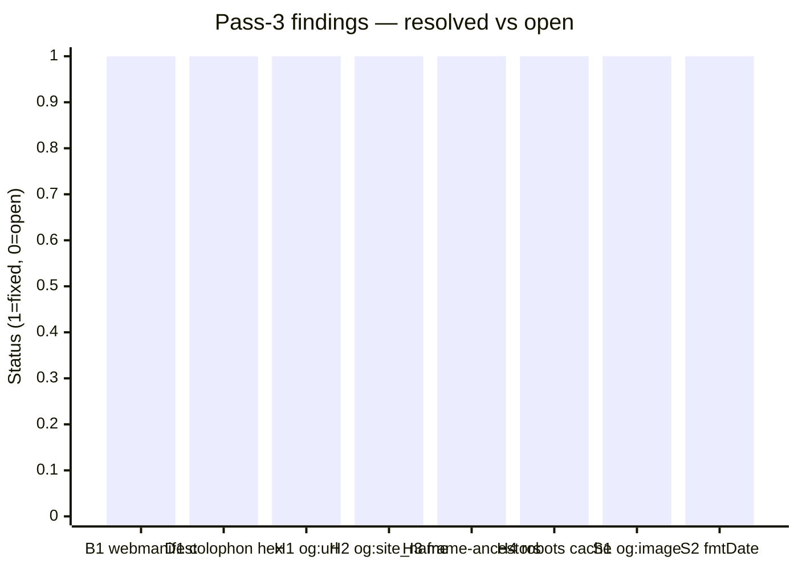
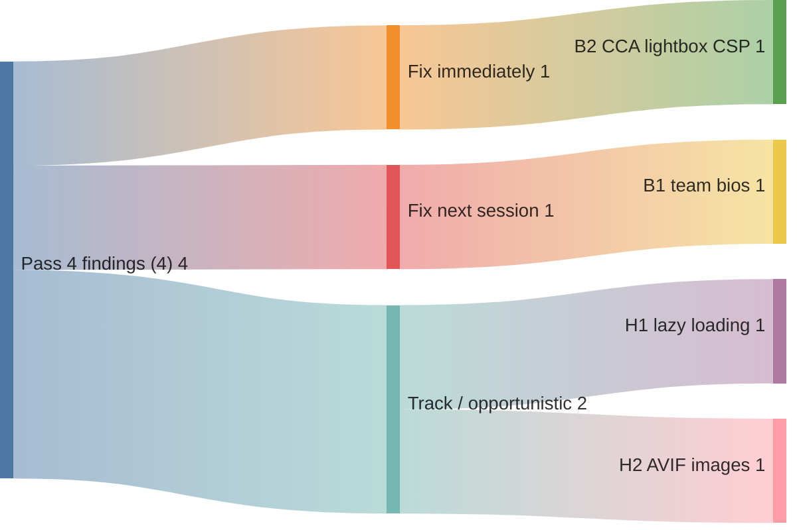

# Code review — indri.studio (pass 4, 2026-05-14)

Fourth pass, starting from HEAD `b8ad1f1` ("Polish: remove dead fmtDate; mark og:image as TODO"). Scope: full `src/`, `worker/`, `public/`, content collections — every file touched by the pass-3 implementation commits plus a fresh read of all adjacent files.

## Pass-3 scorecard



8 of 8 pass-3 findings closed. Clean sweep.

| Finding | Description | Commit |
|---|---|---|
| B1 | `site.webmanifest` rebranding | `470492b` |
| D1 | Colophon grey-900/1000 hex + oklch | `f7e9705` |
| H1 | `og:url` apex-normalize | `f7e9705` |
| H2 | `og:site_name` added | `f7e9705` |
| H3 | CSP `frame-ancestors 'none'` | `98f8059` |
| H4 | robots.txt + sitemap cache rules | `98f8059` |
| S1 | `og:image` TODO | tracked in `[...slug].astro:39` |
| S2 | Dead `fmtDate` | deleted in `b8ad1f1` |

---

## P1 — Bug shipped to users

### B1. Team section shows placeholder bios on the homepage

[`src/content/team/founder-*.md`](../../src/content/team/) — all four entries:

```yaml
bio: Placeholder bio — replace with real text when implementation starts.
```

[`src/pages/index.astro:169`](../../src/pages/index.astro) renders `{member.data.bio}` directly in the visible team section:

```astro
<p class="font-body text-sm text-on-surface-variant">
    {member.data.bio}
</p>
```

Every visitor sees "Placeholder bio — replace with real text when implementation starts." under each name and role. Three of the four names are also placeholders (Founder Two/Three/Four).

Fix: write real bios, or conditionally hide team members whose bio is a placeholder (add a `bioReady: true` flag to frontmatter and filter on it in the homepage query), or omit the team section entirely until the content exists.

---

### B2. CCA lightbox broken — inline script blocked by the current CSP (Content Security Policy)

`commit 98f8059` tightened `script-src` from:

```
script-src 'self' 'unsafe-inline'
```

to:

```
script-src 'self'
```

The inline comment explains the reasoning:

```typescript
// CSP. Scripts are bundled by Astro into /_astro/*.js (self), so
// script-src needs no 'unsafe-inline'.
```

This is correct for `.astro` files — Astro's Vite pipeline collects, bundles, and hashes those. It misses one exception: **Astro does not process `<script>` tags inside markdown content files.** They pass through the remark/rehype pipeline as raw HTML and appear verbatim as inline `<script>` elements in the output HTML.

[`src/content/apps/claude-code-authoring-formats.md:82–156`](../../src/content/apps/claude-code-authoring-formats.md) contains a 75-line inline `<script data-astro-rerun>` block that wires up the entire lightbox — event listeners, `urlFor()`, `render()`, `step()`, keyboard nav, backdrop close, and focus restoration:

```html
<script data-astro-rerun>
  (function() {
    const dlg = document.getElementById('fm-lightbox');
    if (!dlg) return;
    // …70 more lines…
  })();
</script>
```

With `script-src 'self'` in effect, this inline script is blocked by every browser that enforces CSP (Chrome, Firefox, Safari — all modern browsers). Clicking any style tile in the grid does nothing. The lightbox is completely non-functional.

Fix: extract the script to `public/cca-lightbox.js` (static file, served same-origin, allowed by `script-src 'self'`). Replace the inline block with:

```html
<script src="/cca-lightbox.js"></script>
```

The `data-astro-rerun` attribute is irrelevant for an external script — under Astro's ClientRouter swap, externally-referenced scripts re-execute naturally on each navigation when the URL changes.

---

## P3 — Hardening

### H1. CCA grid thumbnails have no `loading="lazy"`

[`src/content/apps/claude-code-authoring-formats.md:52–67`](../../src/content/apps/claude-code-authoring-formats.md) — the `.fm-grid` div contains 15 raw `` elements, none with a `loading` attribute:

```html

<!-- × 15 -->
```

All 15 thumbnails load at page paint regardless of scroll position. They appear below the fold on most viewports (after the header, nav, hero, and prose). The homepage (`index.astro:93`) and the screenshots section (`[...slug].astro:118`) both use `loading="lazy"` correctly; the CCA markdown bypasses Astro's `<Image>` component so the attribute must be added by hand.

Fix: add `loading="lazy"` to every `` in the grid:

```html

```

### H2. CCA lightbox fetches PNG — AVIF/WebP variants unused

The lightbox's `urlFor()` function hardcodes `.png`:

```js
function urlFor(style, type, full) {
  const suffix = full ? '-full' : '';
  const typePart = type === 'memory' ? '' : `-${type}`;
  return `/img/cca-styles/style-${style}${typePart}${suffix}.png`;   // ← always PNG
}
```

`public/img/cca-styles/` contains 124 files per format (PNG, AVIF, WebP), covering every 15-style × 4-type × 2-size combination. AVIF compresses rendered content 50–70% vs PNG. Full-size lightbox images are the heaviest load on the page — serving PNG when AVIF is already present wastes bandwidth on every lightbox open.

Browser compatibility is not a concern: AVIF is supported in Chrome 85+, Firefox 93+, Safari 16+. The `<dialog>` element (required for the lightbox) was added in Chrome 37+, Firefox 53+, Safari 15.4+. AVIF support covers every browser that can run the lightbox at all.

Fix (one-line): change the extension in `urlFor`:

```js
return `/img/cca-styles/style-${style}${typePart}${suffix}.avif`;
```

While touching this: the grid `` tags also reference `.png` files directly. Changing them to `.avif` at the same time (alongside H1) reduces the per-tile payload as well.

---

## What's clearly working well

Pass-3 landed cleanly on all eight findings it targeted:

- **CSP hardening** — `object-src 'none'` and `base-uri 'self'` close plugin/base-tag injection vectors. `frame-ancestors 'none'` closes the clickjacking surface. The reasoning behind each directive is documented in `worker/index.ts`. The inline-script gap (B2 above) is a coverage issue, not a structural problem with the CSP approach.
- **`og:url` + `canonical` parity** — `Astro.url.href.replace("www.", "")` is now applied consistently to both. Scrapers that encounter raw HTML (e.g. a Workers preview URL) get the apex URL from both tags.
- **Colophon palette** — grey-900 (`#3D3833 / oklch(0.24 0.01 60)`) and grey-1000 (`#0A0908 / oklch(0.06 0.01 60)`) match `global.css`. Hex labels and swatch renders are now in sync.
- **CCA image pipeline** — the 372-file library (15 styles × 4 types × 2 sizes × 3 formats) is complete and correctly named. Every thumbnail and full-size combination exists; the `urlFor` naming convention is consistent across the set.
- **View transitions** — the prev/next slide animation, `data-nav-dir` lifecycle, touch swipe with edge-guard, and `pendingDir` clearing on `astro:page-load` are all correct. The `::view-transition-old/new(root)` suppression keeps the header/footer still while the article slides.
- **Font self-hosting** — Space Grotesk and Inter are downloaded at build time, inlined via Astro's Font API, and served same-origin with `font-display: optional`. No cross-origin round-trips on the critical path.
- **`_headers` coverage** — immutable for `/_astro/*` and `/lh/*`, day-fresh for favicons/manifest/robots/sitemap. The tier structure is now complete.

---

## Recommended order of operations



1. **B2** — fix the CCA lightbox immediately. The feature is completely non-functional. Extract `<script data-astro-rerun>` to `public/cca-lightbox.js`.
2. **B1** — write real team bios (or gate the section behind a `bioReady` flag). Needs content, not just code — schedule it.
3. **H1 + H2** — add `loading="lazy"` and switch to AVIF whenever `claude-code-authoring-formats.md` is next touched. Both are line-level edits that can land in one commit.
