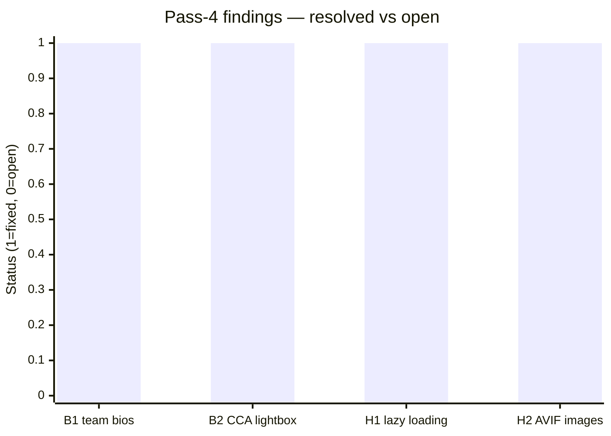
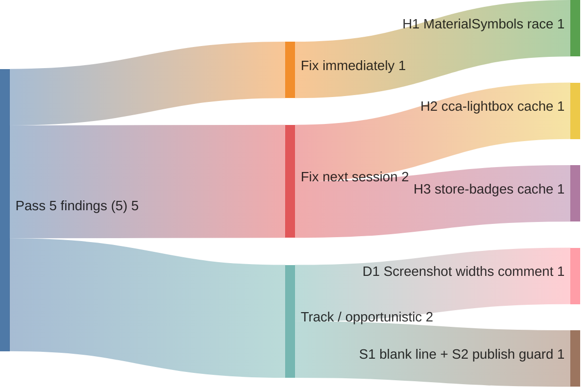

# Code review — indri.studio (pass 5, 2026-05-14)

Fifth pass, starting from HEAD `2a69a42` ("Fix: MaterialSymbols onload → bundled script to clear CSP inspector issue"). Scope: full `src/`, `worker/`, `public/`, `infrastructure/`, `.github/`, `Taskfile.yml`, `astro.config.mjs`, `wrangler.toml`, and all content files.

## Pass-4 scorecard



4 of 4 pass-4 findings closed. Two additional fixes landed beyond the report scope:

| Finding | Description | Commit |
|---|---|---|
| B1 | Team section removed until real content exists | `b867e6f` |
| B2 | CCA lightbox extracted to `public/cca-lightbox.js` | `2b14e03` |
| H1 | `loading="lazy"` on all 15 CCA grid `` elements | `2b14e03` |
| H2 | Grid thumbnails + lightbox switched from `.png` to `.avif` | `2b14e03` |
| ✦ | CSP nonce injection via HTMLRewriter (Lighthouse BP fix) | `f1d9a78` |
| ✦ | MaterialSymbols `onload=""` → bundled script (CSP compliance) | `2a69a42` |

---

## P3 — Hardening

### H1. MaterialSymbols preload-promotion has a load-event race condition

[`src/components/MaterialSymbols.astro:22–27`](../../src/components/MaterialSymbols.astro):

```js
for (const link of document.querySelectorAll('link[rel="preload"][data-promote]')) {
    link.addEventListener('load', () => { link.rel = 'stylesheet'; });
}
```

The bundled module (Astro compiles this `<script>` to `/_astro/*.js`) runs after DOMContentLoaded. The `<link rel="preload">` tag fires its `load` event when the Google Fonts response arrives — a cross-origin request that, on a warm connection (return visitor, DNS cached, TLS resumed), can resolve in 10–30 ms. If the preload completes before the module script executes, the `load` event has already fired, no listener is attached, and the link is never promoted to `rel="stylesheet"`. Material Symbols icons then never load.

The original inline `onload=""` attribute was parsed at the same time as the `<link>` tag, so it was always attached before the fetch could complete. The move to a bundled script (commit `2a69a42`, correct for CSP compliance) introduced this gap.

Visible effect: icons on any page that includes `MaterialSymbols.astro` render as ligature text — `smartphone`, `tablet`, `chevron_left`, `apps`, `home`, `hourglass_top` — instead of glyphs. The homepage platform strip, the catalogue navigation chevrons, and the 404 CTAs are all affected.

Fix — replace the `load`-event approach with a media-swap that carries no race condition:

```html
<!-- Loads without blocking rendering (print media is never "current").
     The script below promotes it to 'all' whenever it runs — before or
     after the fetch, the outcome is the same. -->
<link
    rel="stylesheet"
    media="print"
    data-promote
    href="https://fonts.googleapis.com/css2?family=Material+Symbols+Outlined:wght,FILL@100..700,0..1&display=swap"
/>
<noscript>
    <!-- Already a stylesheet in noscript context; media="all" makes it apply. -->
    <style>
        link[data-promote] { media: all; }
    </style>
</noscript>
```

```js
// No event listener needed — setting media to 'all' is idempotent
// whether the resource has already loaded or is still in-flight.
for (const link of document.querySelectorAll<HTMLLinkElement>('link[data-promote]')) {
    link.media = 'all';
}
```

A `media="print"` stylesheet loads with the same priority as a `media="all"` stylesheet — it does not block rendering, and the `<link>` fetch starts immediately. Switching `media` after the fact makes the browser apply the rules without a second fetch.

The `<noscript>` block becomes a style rule rather than a duplicate `<link>` — cleaner, and doesn't depend on JS-disabled browsers interpreting `onload`.

---

### H2. `/cca-lightbox.js` has no `_headers` cache rule

[`public/cca-lightbox.js`](../../public/cca-lightbox.js) is a stable, stable-URL script (not content-hashed). [`public/_headers`](../../public/_headers) covers `/_astro/*` (immutable), `/img/cca-styles/*` (day-fresh), favicons, webmanifest, robots, and sitemaps — but not `/cca-lightbox.js`. It currently gets the Workers Static Assets default, which is platform-defined and may be zero-length.

Add to `_headers` (same tier as `img/cca-styles/*`):

```
/cca-lightbox.js
  Cache-Control: public, max-age=86400, stale-while-revalidate=604800
```

If the script changes, update the filename (e.g. `cca-lightbox-v2.js`) to bust the one-day cache. Alternatively, the `/img/cca-styles/*` glob already covers all stable non-hashed assets in that directory; a new `/public/scripts/*` convention would let you write one rule for future stable scripts.

---

### H3. `/img/store-badges/*` has no `_headers` cache rule

[`public/img/store-badges/`](../../public/img/) contains the App Store, Google Play, Steam, Blender Extensions, and GitHub badge SVGs. These are stable convention-URL assets (like favicons and the CCA style demos), rendered on every app detail page that has at least one store link. They're currently uncovered by `_headers`.

Add (same tier as other stable assets):

```
/img/store-badges/*
  Cache-Control: public, max-age=86400, stale-while-revalidate=604800
```

---

## P2 — Doc/code drift

### D1. `Screenshot.astro` comment says "three sizes" — widths array has four

[`src/components/Screenshot.astro:20–21`](../../src/components/Screenshot.astro):

```astro
// widths is bounded to three sizes (phone / desktop / desktop-2x)
widths={[480, 720, 960, 1440]}
```

There are four entries: 480 (phone), 720 (tablet), 960 (desktop), 1440 (desktop-2x). The comment was written when the widths were `[480, 960, 1440]` (or similar) and a tablet breakpoint was later added without updating the note. Readers will count four values and distrust the comment.

Fix: update the comment to match, or adjust widths to actually be three if the tablet size isn't providing meaningful image-format savings (it produces an extra AVIF/WebP derivative at build time for every screenshot).

---

## P4 — Style

### S1. Stray blank line in `index.astro` after team section removal

[`src/pages/index.astro:17`](../../src/pages/index.astro) — a leftover blank line sits between the `allApps` query and the closing `---`:

```astro
const allApps = (await getCollection("apps", ({ data }) => !data.draft))
    .sort(…);


---
```

Two blank lines where one suffices. Delete one.

### S2. `publish` task doesn't verify the current branch

[`Taskfile.yml`](../../Taskfile.yml) `publish` task — the task checks for uncommitted changes but not the current branch:

```bash
BRANCH=$(git rev-parse --abbrev-ref HEAD)
# …
git push origin "$BRANCH"
git tag -a "$VERSION" -m "release $VERSION"
git push origin "$VERSION"
```

If run from a feature branch, it pushes that branch AND tags the commit. GitHub Actions deploys from the tagged commit, so it would ship feature-branch code to production. A guard:

```bash
BRANCH=$(git rev-parse --abbrev-ref HEAD)
if [ "$BRANCH" != "main" ]; then
  echo "error: must be on main to publish (currently on '$BRANCH'). Use --force to override." >&2
  exit 1
fi
```

---

## What's clearly working well

Pass-4 is the cleanest pass-to-pass improvement yet. Every finding was closed correctly:

- **CSP nonce pipeline** — `generateNonce()` → header → HTMLRewriter → every `<script>` tag is coherent and correct. The `'unsafe-inline'` backward-compat fallback is properly framed in the comment. `Cache-Control: no-store` on HTML prevents stale nonces.
- **CCA lightbox extraction** — `public/cca-lightbox.js` is a clean IIFE. `<script src="/cca-lightbox.js">` in the markdown gets stamped with a nonce by HTMLRewriter (harmless for external same-origin scripts), and re-executes naturally on Astro's ClientRouter swaps. AVIF and lazy loading all correct.
- **RingFlare + Base scripts converted to bundled modules** — Removes `is:inline`, which was the source of listener accumulation across navigations. The module scope runs once; `astro:page-load` listeners fire on each navigation without accumulating.
- **`ScrollToTop.astro` lifecycle** — Correct use of `astro:before-preparation` to clear state, `astro:page-load` to re-wire. `button()` always re-queries the DOM, so no stale-reference issues after view-transition swaps. Custom smooth-scroll with easeInOutCubic, abort-controller cancellation, and footer-lift are all implemented correctly.
- **Content schema** — The `cssSafe` regex in `theme` values catches `;`, `{`, `}`, `<`, `>`, `\\` injection vectors. `fontImports` validates URLs with `z.string().url()`. Required and optional fields are cleanly separated.
- **Terraform IaC** — Zone has `prevent_destroy = true`. All four email-routing resources are correctly `depends_on` chained. Provider pin (`~> 5.0`) is explicit. Token is environment-sourced, not committed.
- **Lighthouse task** — Auto-enumerates app slugs from `src/content/apps/*.md`. Timestamp on each run. `${RUNS:-3}` default with CI override via `RUNS=1`. Phase-5 threshold script handles both CI (`GITHUB_STEP_SUMMARY`) and local (`/dev/stdout`) output correctly.
- **`_headers` structure** — Three tiers (immutable `/_astro/*` + `/lh/*`; day-fresh stable-URL files; everything else gets platform default) are clearly documented in comments. The `img/cca-styles/*` glob correctly covers all 372 stable-URL image files.

---

## Recommended order of operations



1. **H1** — fix the MaterialSymbols race condition immediately. The window is narrow but real on return visits, and the failure is silent (text instead of icons, no console error).
2. **H2 + H3** — one `_headers` edit adds both `/cca-lightbox.js` and `/img/store-badges/*` cache rules.
3. **D1** — fix the comment when `Screenshot.astro` is next touched.
4. **S1 + S2** — delete the blank line and add the branch guard whenever `index.astro` or `Taskfile.yml` is next edited.
