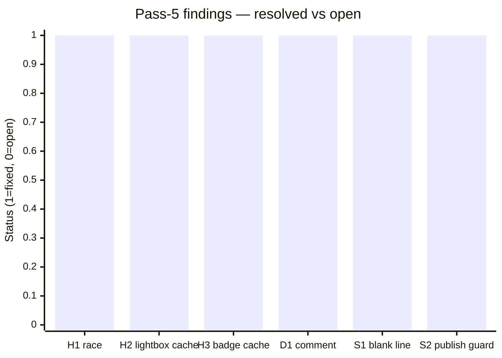
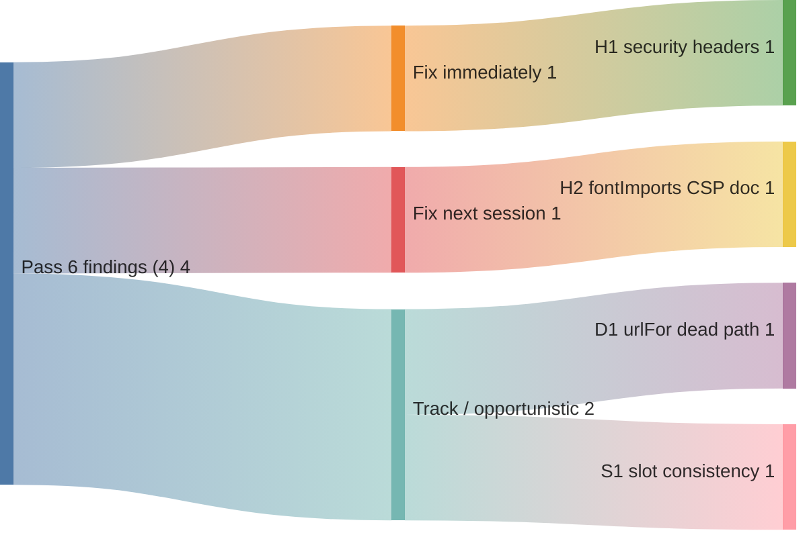

# Code review — indri.studio (pass 6, 2026-05-14)

Sixth pass, starting from HEAD at the end of the cache-busting implementation session.
Scope: full `src/`, `worker/`, `public/`, `.github/`, `Taskfile.yml`,
`astro.config.mjs`, `wrangler.toml`, and all content files.

## Pass-5 scorecard



6 of 6 pass-5 findings closed:

| Finding | Description | How closed |
|---|---|---|
| H1 | MaterialSymbols race condition | `media="print"` → `media="all"` pattern (idempotent, no race) |
| H2 | `/cca-lightbox.js` missing cache rule | Superseded: script moved to `/_astro/*` via `?url` import (see below) |
| H3 | `/img/store-badges/*` missing cache rule | User added to `_headers` |
| D1 | `Screenshot.astro` comment said "three sizes" | Comment now says "four sizes (phone / tablet / desktop / desktop-2x)" |
| S1 | Stray double-blank-line in `index.astro` | Gone — structure cleaned up during team-section removal |
| S2 | `publish` task didn't guard branch | User added `if [ "$BRANCH" != "main" ]` guard |

### Additional implementation: `cca-lightbox.js` content-hash cache-busting

Pass-5 H2's suggestion ("rename to `cca-lightbox-v2.js`") was replaced with an
automatic system:

- `public/cca-lightbox.js` **deleted**; script moved to `src/scripts/cca-lightbox.js`
- `src/pages/apps/[...slug].astro` imports it with
  `import lightboxUrl from '../../scripts/cca-lightbox.js?url'` and injects
  `{post.id === 'claude-code-authoring-formats' && <script src={lightboxUrl}></script>}`
  only on the CCA (Claude Code Authoring Formats) app page
- `vite.build.assetsInlineLimit: 0` added to `astro.config.mjs` — forces Vite
  to emit the file as `/_astro/cca-lightbox.<sha8>.js` rather than inlining it
  as a `data:` URI (default threshold is 4 KB; the 2.7 KB file was below it)
- `/cca-lightbox.js` rule **removed** from `public/_headers` — the script now
  lives under `/_astro/*` and inherits the existing `immutable, max-age=31536000` rule
- Build verification: `dist/apps/claude-code-authoring-formats/index.html`
  contains `<script src="/_astro/cca-lightbox.COzsTI5J.js">` — hashed URL confirmed

---

## P3 — Hardening

### H1. Worker sets only two response headers on HTML responses

[`worker/index.ts:40–53`](../../worker/index.ts):

```typescript
headers.set("Cache-Control", "no-store");
headers.set("Content-Security-Policy", /* … */);
// No other security headers set
```

Three widely-expected security headers are absent:

| Header | Recommended value | Why |
|---|---|---|
| `X-Content-Type-Options` | `nosniff` | Prevents browsers from MIME-sniffing a response away from the declared `Content-Type`. Workers Static Assets sets `Content-Type` correctly, but without `nosniff` a browser may still infer a different type for certain edge-case responses. |
| `Referrer-Policy` | `strict-origin-when-cross-origin` | Controls what `Referer` header value outgoing navigations and sub-resource fetches carry. Full URL by default leaks path + query on cross-origin links. The colophon links to GitHub and Google Fonts; with `strict-origin-when-cross-origin` only the origin (`https://indri.studio`) is sent. |
| `Permissions-Policy` | `camera=(), microphone=(), geolocation=()` | Explicitly disables browser APIs the site doesn't need. Prevents accidental or injected code from requesting camera/mic access under the site's origin. |

Fix — add to the `if (ct.includes("text/html"))` branch in `worker/index.ts`:

```typescript
headers.set("X-Content-Type-Options", "nosniff");
headers.set("Referrer-Policy", "strict-origin-when-cross-origin");
headers.set("Permissions-Policy", "camera=(), microphone=(), geolocation=()");
```

`X-Frame-Options: DENY` is intentionally omitted — `frame-ancestors 'none'` in
the CSP (Content Security Policy) is the modern equivalent and is already present.
`X-Frame-Options` would be relevant only for browsers predating CSP Level 2 (IE 10),
which is below this site's support bar.

---

### H2. `fontImports` in app frontmatter silently breaks if the URL isn't in `style-src`

[`src/layouts/AppLayout.astro:48–54`](../../src/layouts/AppLayout.astro) and
[`worker/index.ts:48`](../../worker/index.ts):

```astro
{fontImports.map((href) => <link rel="stylesheet" href={href} />)}
```

```typescript
`style-src 'self' 'unsafe-inline' fonts.googleapis.com; `
```

The `apps` content schema validates `fontImports` entries as valid URLs
(`z.string().url()`), but the CSP's `style-src` only permits
`fonts.googleapis.com` alongside `'self'`. Any `fontImports` URL that references
a different CSS CDN (e.g. `use.typekit.net`, `fonts.bunny.net`) is silently
blocked at the browser: no build error, no console error visible in dev mode
(dev mode doesn't apply the worker's CSP), and the fonts just don't load in
production.

The current app content only uses Google Fonts, so this isn't a live bug. It
becomes one the moment a new app uses a different font host.

Two options:

**a. Document the constraint** — add a comment to the `fontImports` field in
`src/content.config.ts`:

```ts
fontImports: z
  .array(z.string().url())
  .default([])
  // Note: each URL's origin must also appear in the CSP `style-src` in
  // worker/index.ts. Adding a non-Google Fonts URL here without updating
  // the CSP causes silent failures in production.
```

**b. Validate the origin** — refine the schema to only accept Google Fonts
URLs (or a named allowlist):

```ts
fontImports: z
  .array(
    z.string().url().refine(
      (url) => new URL(url).hostname.endsWith('googleapis.com'),
      { message: "fontImports must be googleapis.com URLs (other origins require a CSP update)" }
    )
  )
  .default([])
```

Option (a) is lighter and sufficient while only Google Fonts is used. Option (b)
provides a build-time error that saves debugging time if the allowlist ever
diverges.

---

## P2 — Doc/code drift

### D1. `urlFor` in `cca-lightbox.js` has an unused `full=false` code path

[`src/scripts/cca-lightbox.js:19–23`](../../src/scripts/cca-lightbox.js):

```js
function urlFor(style, type, full) {
  const suffix = full ? '-full' : '';
  // …
}
```

`urlFor` is called exactly once: `img.src = urlFor(style, type, true)` inside
`render()`. The `full=false` path (`suffix=''`) is dead code. The thumbnail
filenames (no `-full` suffix) are used only in the grid `` tags in the
markdown, which are static HTML, not driven by `urlFor`.

Fix: simplify `urlFor` to drop the parameter:

```js
function urlFor(style, type) {
  const typePart = type === 'memory' ? '' : `-${type}`;
  return `/img/cca-styles/style-${style}${typePart}-full.avif`;
}
```

Or keep the parameter and add a comment if full-size / thumbnail switching is
planned for a future feature.

---

## P4 — Style

### S1. `slot="head"` on `MaterialSymbols` is inconsistent across layouts

`src/pages/index.astro:19` and `src/pages/404.astro:9` both use:

```astro
<MaterialSymbols slot="head" />
```

`src/layouts/AppLayout.astro` renders `<MaterialSymbols />` directly without
`slot="head"`:

```astro
<MaterialSymbols />
```

Both work because `Base.astro`'s head slot accepts the component in either case.
But the explicit `slot="head"` on the homepage and 404 page implies it would
*not* work without the slot attribute, which is misleading when comparing to
`AppLayout`. Drop `slot="head"` from `index.astro` and `404.astro` to match
`AppLayout`'s usage.

---

## What's clearly working well

- **`cca-lightbox.js` lifecycle is correct for ClientRouter navigation.** The
  IIFE guards on `document.getElementById('fm-lightbox')` and exits early on
  pages without a lightbox. ClientRouter re-executes body scripts on each
  navigation; the old DOM nodes (and their listeners) are discarded with the
  swapped content; the fresh IIFE run attaches to the new dialog. No listener
  accumulation.

- **Keyboard navigation is complete.** Arrow keys (handled explicitly with
  `preventDefault`), Escape (native `<dialog>` behavior — fires `close` event
  which resets state and restores opener focus), backdrop click (`e.target ===
  dlg`), and the five control buttons are all correctly wired.

- **All 60 image combinations are present.** 15 styles × 4 types (memory,
  skill, subagent, slash-command) × 2 sizes (thumbnail, full) × 3 formats
  (avif, png, webp) — `urlFor`'s cross-type navigation produces URLs that exist
  for every combination the lightbox can reach.

- **`assetsInlineLimit: 0` has no collateral damage.** The only JS file in
  `src/` imported with `?url` is `cca-lightbox.js`. Astro's `<Image>` /
  `<Picture>` pipeline handles image assets independently of Vite's inline
  limit. All other hashed asset behaviour is unchanged.

- **Deploy workflow is solid.** Tag-driven deploy, post-deploy Lighthouse
  (informational), CLS budget check, phase-5 threshold check, per-tag archive
  to `public/lh/<tag>/` committed back to main — all stages are correct.
  `continue-on-error: true` on audit steps means a Lighthouse regression never
  blocks a ship; it surfaces as a red badge in the Actions UI on the next PR.

- **CSP pipeline is coherent.** Per-request nonce via `crypto.getRandomValues()`,
  HTMLRewriter stamps every `<script>` element, `'unsafe-inline'` is the CSP
  Level 1 fallback (ignored by modern browsers when nonce is present). The new
  hashed lightbox script (`/_astro/*.js`) is already allowed by `'self'` and
  also gets a nonce stamp — correct.

---

## Recommended order of operations



1. **H1** — one block of `headers.set()` calls in `worker/index.ts`; ship in
   the next deploy.
2. **H2** — add a comment to `src/content.config.ts` `fontImports` field; one
   line, no behaviour change.
3. **D1** — simplify `urlFor` when next touching `cca-lightbox.js`.
4. **S1** — drop `slot="head"` when next touching `index.astro` or `404.astro`.
