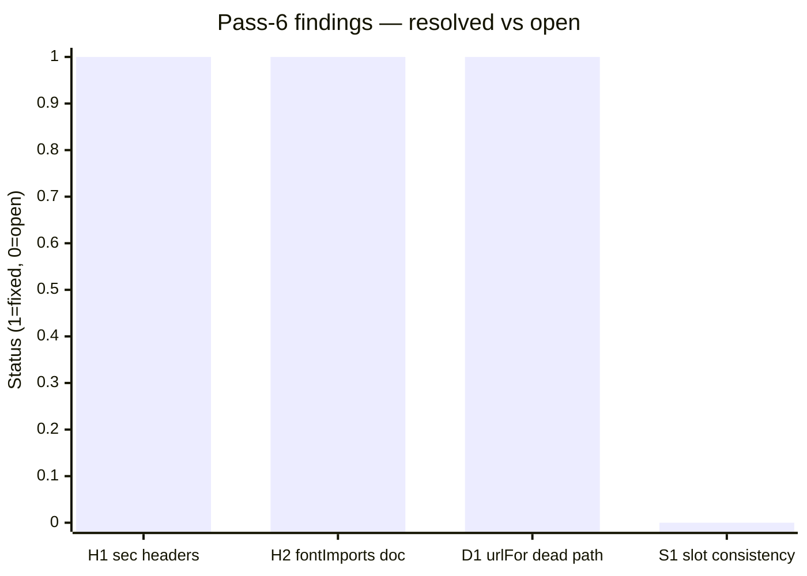
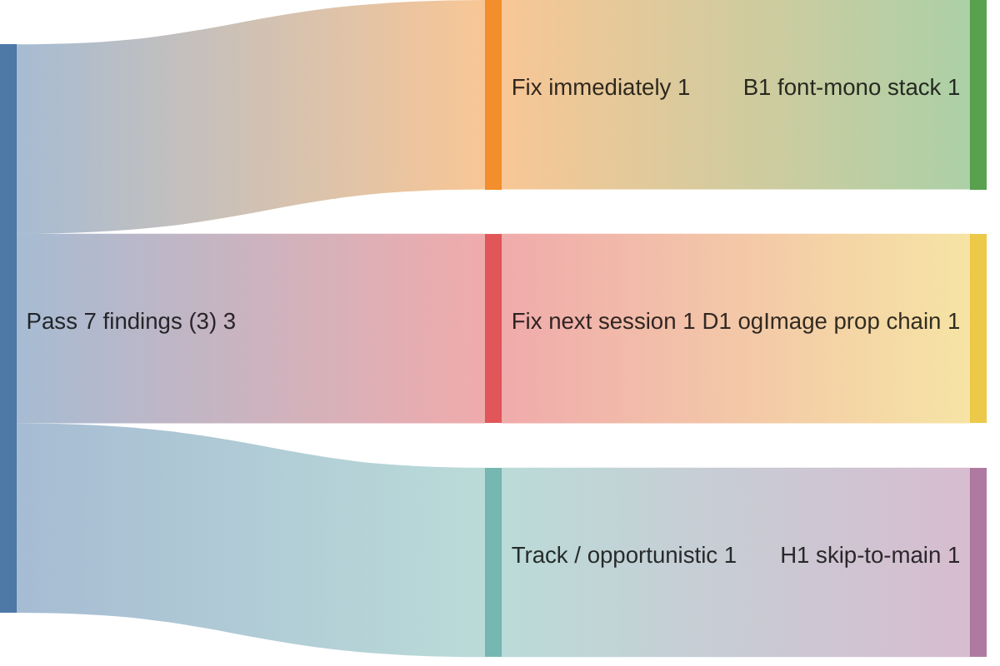

# Code review — indri.studio (pass 7, 2026-05-14)

Seventh pass at current HEAD. Scope: layouts, global styles, content, infrastructure,
scripts, and OG/SEO surface — areas not exhaustively covered in passes 1–6.

## Pass-6 scorecard



3 of 4 pass-6 findings closed; S1 (`slot="head"` inconsistency) remains deferred:

| Finding | Description | How closed |
|---|---|---|
| H1 | Missing `X-Content-Type-Options`, `Referrer-Policy`, `Permissions-Policy` | Added to `worker/index.ts` |
| H2 | `fontImports` CSP constraint undocumented | Comment added to `src/content.config.ts` |
| D1 | `urlFor` dead `full=false` path | User simplified: parameter removed, URL hardcoded to `-full.avif` |
| S1 | `slot="head"` inconsistency on MaterialSymbols | Still deferred |

---

## P1 — Bugs

### B1. `--font-mono` resolves to Space Grotesk — code blocks use a proportional font

[`src/styles/global.css:117`](../../src/styles/global.css):

```css
--font-mono: var(--font-space-grotesk), ui-monospace, SFMono-Regular, Menlo, monospace;
```

Space Grotesk is self-hosted via Astro's Fonts API and always available. Since it
appears first in the stack, `font-family: var(--font-mono)` resolves to Space Grotesk
on every browser — the monospace fallbacks (`ui-monospace`, `Menlo`, etc.) are never
reached.

Affected call sites:

- [`src/pages/apps/[...slug].astro:281`](../../src/pages/apps/[...slug].astro) —
  `.prose :global(code)` sets `font-family: var(--font-mono)`; all inline `<code>` in
  app pages (including CCA's `FRONTMATTER_STYLE=<name>`, scripts/paths in shell
  examples, etc.) render in Space Grotesk
- [`src/pages/colophon.astro`](../../src/pages/colophon.astro) — dozens of
  `class="font-mono"` Tailwind utilities on hex values (`#6600FF`), CSS identifiers
  (`.astro`, `@property`), path names (`_astro/fonts/`) — all proportional

Fix: remove Space Grotesk from the mono stack entirely:

```css
--font-mono: ui-monospace, SFMono-Regular, Menlo, Monaco, Consolas,
             "Liberation Mono", "Courier New", monospace;
```

This is the standard system-monospace stack (same as Tailwind's `font-mono` default)
and requires no new font downloads. The Tailwind `font-mono` utility already compiles
to this stack independently; `--font-mono` is a separate CSS custom property used only
for the prose `code` rule in `[...slug].astro`.

---

## P2 — Doc/code drift

### D1. OG image prop chain is broken at `AppLayout` — wire-up cannot complete from `[...slug].astro` alone

[`src/layouts/AppLayout.astro:11–25`](../../src/layouts/AppLayout.astro) and
[`src/layouts/Base.astro:14`](../../src/layouts/Base.astro):

`Base` already supports `ogImage?: string` (line 14). When provided, it renders
`<meta property="og:image" content={ogImage} />` and upgrades Twitter Card to
`summary_large_image` (line 39–40). The infrastructure is ready.

`AppLayout` does not declare or forward `ogImage`:

```astro
<!-- AppLayout Props interface (current): -->
interface Props {
    title: string;
    description?: string;
    theme?: { … };
    prevHref?: string;
    nextHref?: string;
    // ogImage is absent
}

<!-- AppLayout passes to Base: -->
<Base title={title} description={description} ringFlare={false}>
<!-- ogImage is not threaded -->
```

The TODO comment in `[...slug].astro:39–42` ("pass post.data.screenshots[0] as
ogImage once AppLayout/Base prop-threading is wired") correctly diagnoses the gap,
but the fix requires two changes, not one:

1. Add `ogImage?: string` to `AppLayout`'s Props interface and forward it:
   ```astro
   <Base title={title} description={description} ogImage={ogImage} ringFlare={false}>
   ```

2. In `[...slug].astro`, compute and pass the OG image URL. Screenshots are now
   `ImageMetadata` objects after the asset-pipeline migration — `post.data.screenshots[0]?.src.src`
   gives the relative `/_astro/<hash>.png` path. OG image URLs must be absolute:
   ```astro
   const ogImage = post.data.screenshots.length > 0
       ? new URL(post.data.screenshots[0].src.src, Astro.site).href
       : undefined;
   ```

Until this lands, every app page and both homepage/colophon send `twitter:card: summary`
(no image) on social shares — a significant SEO and social preview regression given that
app screenshots exist for most apps.

---

## P3 — Hardening

### H1. `<main>` has no `id` — skip-to-main link cannot be wired

[`src/layouts/Base.astro:171`](../../src/layouts/Base.astro):

```astro
<main class="flex-1 w-full flex flex-col">
```

No `id="main"` and no skip-to-main anchor. WCAG 2.4.1 (Level&nbsp;A) — "Bypass
Blocks" — requires a mechanism to skip repeated navigation when there are keyboard
users. The site's persistent header (`indri` wordmark + colophon link) is small
(two elements), so the practical impact is low, but the criterion still applies.

Fix:

```astro
<a href="#main" class="sr-only focus:not-sr-only focus:absolute focus:top-4 focus:left-4
    focus:z-50 focus:px-4 focus:py-2 focus:bg-surface-container
    focus:text-on-surface focus:rounded focus:ring-2 focus:ring-primary-container">
    Skip to main content
</a>
<!-- …existing header… -->
<main id="main" class="flex-1 w-full flex flex-col">
```

`sr-only` (Tailwind's screen-reader-only class) hides the link visually; it becomes
visible on focus, satisfying WCAG 2.4.1 without adding visible chrome. The anchor
must appear before the header in source order so it's the first Tab stop.

---

## What's clearly working well

- **`wrangler.toml` is correct.** `not_found_handling = "404-page"` routes 404s to
  the compiled `dist/404.html`. `run_worker_first = true` ensures the www→apex
  redirect fires before static-asset lookup. No hardcoded secrets or account IDs.
- **OG infrastructure in `Base.astro` is ready.** `ogImage?: string` prop, conditional
  `og:image` meta tag, and `summary_large_image` twitter card upgrade are all correctly
  implemented. Only the prop chain through `AppLayout` is missing.
- **Security headers are complete after pass-6.** `X-Content-Type-Options: nosniff`,
  `Referrer-Policy: strict-origin-when-cross-origin`, `Permissions-Policy`, and the
  full CSP (Content Security Policy) with per-request nonce are all present.
- **All 60 lightbox image combinations exist.** 15 styles × 4 types × full-size AVIF
  assets all confirmed present in `public/img/cca-styles/`.
- **Secrets scripts are solid.** `secrets-pull.sh` and `secrets-bootstrap.sh`
  use `set -euo pipefail`, handle `--help`, use `file://` argument to SSM CLI to
  avoid secrets appearing in `argv`, and are idempotent.

---

## Recommended order of operations



1. **B1** — one-line fix in `global.css`; no other changes needed.
2. **D1** — three changes: `AppLayout` Props + Base forwarding, `[...slug].astro`
   ogImage computation. Wire up once screenshots are confirmed 1200×630-ish in
   aspect ratio (or crop/resize via Astro's `getImage()` with explicit dimensions).
3. **H1** — add skip link + `id="main"` to `Base.astro`; one focused commit.
