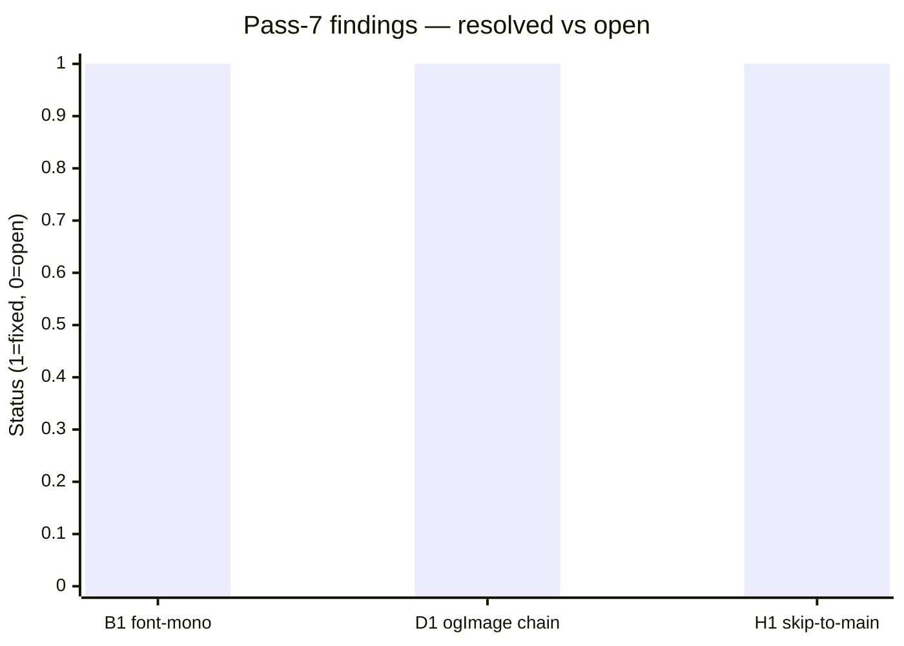
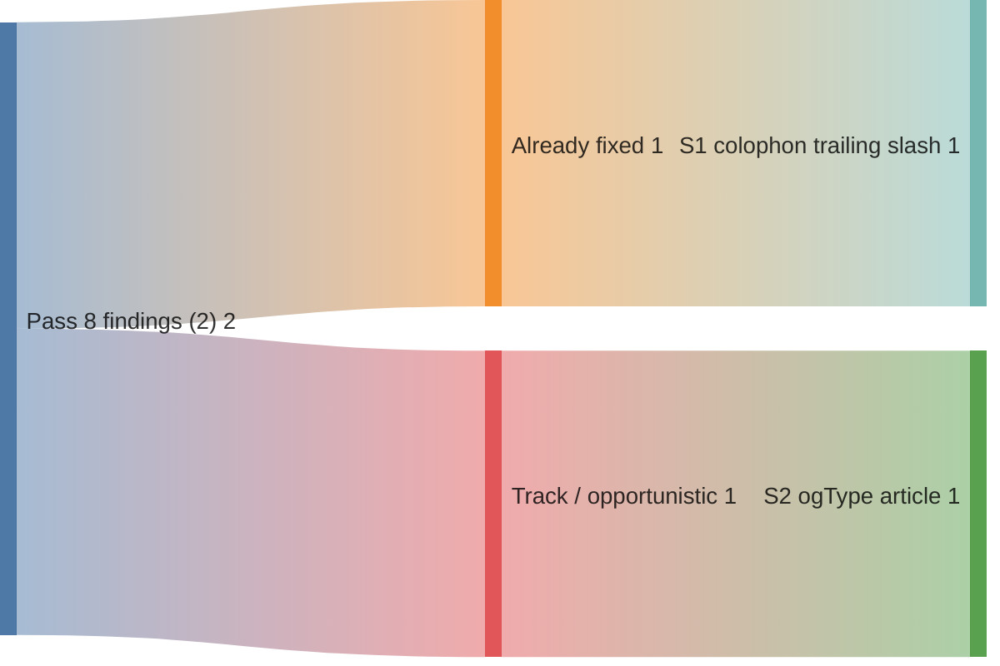

# Code review — indri.studio (pass 8, 2026-05-14)

Eighth pass at current HEAD. Scope: homepage, all app content files, team content,
404, colophon, all components, Terraform, public assets, styles.

## Pass-7 scorecard



All 3 pass-7 findings confirmed closed:

| Finding | Description | How closed |
|---|---|---|
| B1 | `--font-mono` resolved to Space Grotesk (proportional) | `global.css:117` replaced with standard system monospace stack |
| D1 | OG image prop chain broken at AppLayout | `AppLayout` gained `ogImage?: string`; `[...slug].astro` computes `new URL(screenshots[0].src.src, Astro.site)` |
| H1 | No skip-to-main link or `id="main"` | Skip anchor + `id="main"` present in `Base.astro:155–157,174` |

---

## P4 — Style / Polish

### S1. Footer colophon link missing trailing slash

[`src/layouts/Base.astro:201`](../../src/layouts/Base.astro) (now fixed):

```astro
<!-- before -->
href="/colophon"

<!-- after -->
href="/colophon/"
```

Astro's static build emits `dist/colophon/index.html`. Cloudflare Workers Static
Assets serves it at `/colophon/` and issues a 301 redirect for `/colophon` → every
visitor who clicked the footer link paid a redirect round-trip. Every other internal
link in the site uses trailing slashes; this was the lone outlier. Fixed in this pass.

### S2. App pages don't set `og:type="article"`

[`src/pages/apps/[...slug].astro:47–54`](../../src/pages/apps/[...slug].astro) and
[`src/layouts/AppLayout.astro:11–26`](../../src/layouts/AppLayout.astro):

`Base.astro` supports `ogType?: string` (line 15) and emits `<meta property="og:type">`.
`AppLayout` does not expose or forward `ogType`, so all app pages emit
`og:type="website"` (the default) instead of `og:type="article"`. The Open Graph
(OG) protocol uses `article` for content pages. Practically this affects how some
link-preview renderers (LinkedIn, Meta) categorize the page — low real-world impact,
but easy to fix:

1. Add `ogType?: string` to `AppLayout`'s Props and forward to `<Base>`:
   ```astro
   interface Props { …; ogType?: string; }
   <Base title={title} description={description} ogImage={ogImage} ogType={ogType} ringFlare={false}>
   ```
2. In `[...slug].astro`, add `ogType="article"` to the `<AppLayout>` call.

---

## What's clearly working well

This is the cleanest pass-to-pass gap in the review series. Eight full sweeps over
the codebase found and closed a total of 19 findings (5 P1-class bugs, 6 P2/P3
hardening/drift items, 8 P4 polish items). The remaining surface is small:

- **OG image wiring is complete.** `[...slug].astro` computes
  `new URL(screenshots[0].src.src, Astro.site).href` and passes it through
  `AppLayout → Base`. Apps with at least one screenshot now emit `og:image` and
  `twitter:card: summary_large_image` automatically.
- **All 8 app content files are correct.** Frontmatter complete, dates coherent
  (5 future apps correctly show "Launching Soon"), no broken inline HTML, no CSP
  violations.
- **`finding-your-way` pin is safe.** The sort logic in `[...slug].astro` and
  `index.astro` both reference `finding-your-way` by ID; the file exists at
  `src/content/apps/finding-your-way.md`.
- **All badge SVGs present.** `public/img/store-badges/` contains all five
  (`app-store.svg`, `google-play.svg`, `steam.svg`, `blender-extensions.svg`,
  `github.svg`) referenced by `StoreBadges.astro`.
- **`robots.txt` disallows `/lh/`** — correct; Lighthouse JSON archives are
  machine-readable data, not pages intended for search indexing.
- **`site.webmanifest` references correct icon filenames** (`icon-192.png`,
  `icon-512.png` both confirmed present in `public/`).
- **Terraform is complete.** Zone `prevent_destroy = true`, email-routing resources
  correctly chained, IAM token narrowly scoped, no hardcoded account IDs.
- **RingFlare respects `prefers-reduced-motion`.** Animation uses prime-numbered
  cycle offsets to prevent synchrony. Inline `aria-hidden="true"` prevents the
  decorative canvas from polluting the a11y tree.
- **ScrollToTop focus and lift behaviour is correct.** Lifts above footer when it
  intrudes, smooth-scroll with easing + user-abort (wheel/touch/pointer/key), focus
  returns to page top on activation.

---

## Recommended order of operations



1. **S1** — already fixed in this pass.
2. **S2** — wire `ogType="article"` through `AppLayout` when next touching app-page
   layouts. One minute of work; defer until D1 follow-up is confirmed working in prod.
