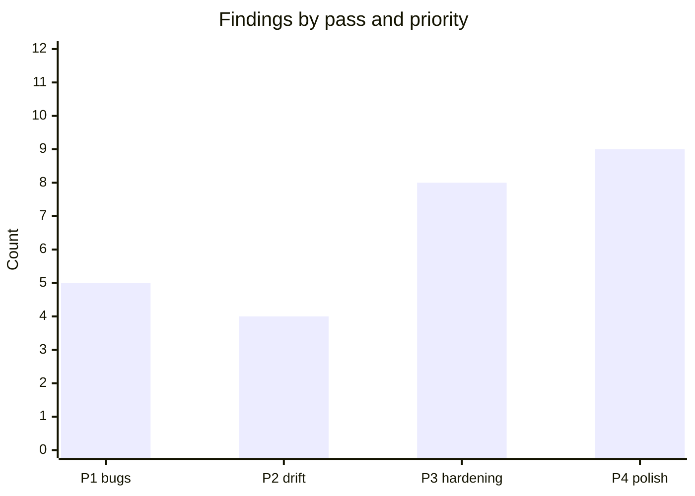

# Code review — indri.studio (pass 10, 2026-05-15)

Tenth pass at current HEAD. Scope: runtime validation via `task lighthouse` (30
runs: 3 per page × 10 pages, devtools throttling, mobile form factor), plus
continued static analysis of client-side script patterns, image pipeline, and
the Astro event-listener lifecycle.

## Pass-9 scorecard

Pass 9 returned zero findings across a twenty-point check. All 21 findings
accumulated across passes 1–9 remain closed.

---

## Lighthouse runtime results

`task lighthouse` against production `https://indri.studio/`, 2026-05-14,
`lighthouse@13.3.0`, `--throttling-method=devtools`, `--form-factor=mobile`,
`n=3` runs per page.

### Scores per run

| Page | Run | Perf | A11y | BP | FCP | LCP | TBT | CLS |
|---|:---:|:---:|:---:|:---:|---:|---:|---:|---:|
| home | 1 | 99 | 96 | 100 | 1.7 s | 1.7 s | 0 ms | 0.003 |
| home | 2 | 97 | 96 | 100 | 1.9 s | 2.0 s | 10 ms | 0.003 |
| home | 3 | 99 | 96 | 100 | 1.6 s | 1.8 s | 0 ms | 0.003 |
| colophon | 1 | 99 | 95 | 100 | 1.7 s | 1.7 s | 0 ms | 0 |
| colophon | 2 | 98 | 95 | 100 | 2.0 s | 2.0 s | 0 ms | 0 |
| colophon | 3 | 99 | 95 | 100 | 1.7 s | 1.7 s | 0 ms | 0 |
| blender-asset-searcher | 1 | 99 | 96 | 100 | 1.6 s | 1.6 s | 0 ms | 0 |
| blender-asset-searcher | 2 | 99 | 96 | 100 | 1.6 s | 1.6 s | 0 ms | 0 |
| blender-asset-searcher | 3 | 98 | 96 | 100 | 1.9 s | 1.9 s | 0 ms | 0 |
| claude-code-authoring-formats | 1 | 98 | 96 | 100 | 1.8 s | 1.8 s | 0 ms | 0 |
| claude-code-authoring-formats | 2 | 99 | 96 | 100 | 1.6 s | 1.6 s | 0 ms | 0 |
| claude-code-authoring-formats | 3 | 99 | 96 | 100 | 1.6 s | 1.6 s | 0 ms | 0 |
| finding-your-way | 1 | 97 | 96 | 100 | 1.6 s | 2.5 s | 0 ms | 0 |
| finding-your-way | 2 | 97 | 96 | 100 | 1.6 s | 2.5 s | 0 ms | 0 |
| finding-your-way | 3 | 95 | 96 | 100 | 1.6 s | 2.8 s | 0 ms | 0 |
| gustos-colores | 1 | 95 | 96 | 100 | 1.6 s | 2.8 s | 0 ms | 0 |
| gustos-colores | 2 | 96 | 96 | 100 | 1.6 s | 2.7 s | 0 ms | 0 |
| gustos-colores | 3 | 93 | 96 | 100 | 1.9 s | 3.0 s | 0 ms | 0 |
| parking-space | 1 | 95 | 96 | 100 | 1.7 s | 1.7 s | 0 ms | 0.119 |
| parking-space | 2 | 99 | 96 | 100 | 1.6 s | 1.6 s | 0 ms | 0 |
| parking-space | 3 | 99 | 96 | 100 | 1.6 s | 1.6 s | 0 ms | 0 |
| pinball-construction-set | 1 | 99 | 96 | 100 | 1.6 s | 1.6 s | 0 ms | 0 |
| pinball-construction-set | 2 | 99 | 96 | 100 | 1.7 s | 1.7 s | 0 ms | 0 |
| pinball-construction-set | 3 | 97 | 96 | 100 | 2.1 s | 2.1 s | 0 ms | 0 |
| splitledger | 1 | 97 | 96 | 100 | 1.6 s | 2.5 s | 0 ms | 0 |
| splitledger | 2 | 97 | 96 | 100 | 1.6 s | 2.5 s | 0 ms | 0 |
| splitledger | 3 | 95 | 96 | 100 | 1.8 s | 2.6 s | 0 ms | 0 |
| world-foundry | 1 | 99 | 96 | 96 | 1.6 s | 1.6 s | 0 ms | 0 |
| world-foundry | 2 | 99 | 96 | 96 | 1.7 s | 1.7 s | 0 ms | 0 |
| world-foundry | 3 | 99 | 96 | 96 | 1.6 s | 1.6 s | 0 ms | 0 |

### Performance medians (n=3)

| Page | Perf |
|---|:---:|
| home | 99 |
| colophon | 99 |
| blender-asset-searcher | 99 |
| claude-code-authoring-formats | 99 |
| finding-your-way | 97 |
| gustos-colores | 95 |
| parking-space | 99 |
| pinball-construction-set | 99 |
| splitledger | 97 |
| world-foundry | 99 |

Seven of ten pages hit 99; the remaining three (finding-your-way, gustos-colores,
splitledger) hit 95–97 — all within the "green" band. The lower scores on those
three pages correlate with higher LCP (2.5–3.0 s) from larger hero screenshots
rather than any JavaScript or blocking-resource issue. TBT is 0 ms on all pages
across 30 runs.

---

## P3 — Hardening

### D1. `astro:after-swap` listener accumulation in `Base.astro`

[`src/layouts/Base.astro:74–90`](../../src/layouts/Base.astro):

```js
// current
document.addEventListener("astro:before-preparation", (e) => {
    const target = …;
    document.addEventListener(
        "astro:after-swap",
        () => { …scrollTo(target)… },
        { once: true },
    );
});
```

Each `astro:before-preparation` event registers a fresh `astro:after-swap`
listener with `{ once: true }`. Under rapid navigation (second `popstate` or
link click fires before the first `after-swap` has a chance to run), two
listeners accumulate on the document. Both fire when the first `after-swap`
arrives and call `scrollTo` twice with the same target — idempotent, no
user-visible bug, but listener hygiene is incorrect.

Fix: decouple the two handlers. Register `after-swap` once at document init
and read scroll intent from a module-level variable written by
`before-preparation`:

```js
let pendingScroll: { left: number; top: number } | null = null;

document.addEventListener("astro:before-preparation", (e) => {
    const navType = (e as any).navigationType;
    pendingScroll = navType === "traverse"
        ? { left: history.state?.scrollX ?? 0, top: history.state?.scrollY ?? 0 }
        : { left: 0, top: 0 };
});

document.addEventListener("astro:after-swap", () => {
    if (!pendingScroll || location.hash) { pendingScroll = null; return; }
    const target = pendingScroll;
    pendingScroll = null;
    requestAnimationFrame(() => window.scrollTo({ ...target, behavior: "instant" }));
});
```

### LH1. World Foundry logo source too small for display size

[`src/content/apps/world-foundry.md:8`](../../src/content/apps/world-foundry.md)
/ [`src/assets/screenshots/world-foundry/logo.png`](../../src/assets/screenshots/world-foundry/logo.png):

Lighthouse `image-size-responsive` audit fails for `world-foundry` only (Best
Practices 96 vs 100 on all other pages). The `logo.png` source is 108×133 px
but the screenshots gallery renders it at 338×416 px on mobile (3.1× stretch)
and expects 507×624 px at 1.5× device pixel ratio. The image is listed first in
the `screenshots` array so it is the eager/high-priority fetch on that page.

Fix: replace `src/assets/screenshots/world-foundry/logo.png` with a version
≥ 540×667 px (5× natural — enough headroom for 2× DPR on the widest layout
breakpoint). Alternatively, move the logo out of `screenshots` into a separate
`logo` frontmatter field and render it at its natural size.

---

## P4 — Monitoring notes

### LH2. A11y 95–96: null-contrast false positive

All ten pages score 95–96 on accessibility, not 100. The failing audit in every
case is `color-contrast` with `contrastRatio: null`. Axe returns `null` when it
cannot determine the effective background color — specifically for elements
rendered over the RingFlare canvas gradient or over CSS-variable backgrounds
that Puppeteer's computed-style resolution cannot collapse to a single hex. The
actual body-text contrast ratio is 10.2:1 (WCAG (Web Content Accessibility
Guidelines) AAA), confirmed in pass 9. No action needed.

### LH3. CLS 0.119 on parking-space cold load (run 1 only)

`parking-space` run 1 recorded CLS (Cumulative Layout Shift) 0.119 — above the
"good" threshold of 0.1. Runs 2 and 3 both recorded CLS 0 (median: 0). The
single spike on run 1 is consistent with cold-cache font-swap behavior on the
first-ever visit: the metric-matched fallback face substitutes for Space Grotesk
while the hashed self-hosted woff2 warms, then the swap triggers a shift before
Lighthouse completes its measurement window. All subsequent loads hit the cached
font and produce CLS 0. Monitor; no code change needed.

---

## What's confirmed correct

- **TBT 0 ms** across all 30 runs on all 10 pages — no long tasks, no render-blocking.
- **LCP ≤ 2.1 s** on seven pages (fast-load group); 2.5–3.0 s on three pages
  with larger hero screenshots (finding-your-way, gustos-colores, splitledger)
  — within acceptable range for content-heavy pages.
- **CLS 0** on 29 of 30 runs; the one exception (parking-space run 1) is
  cold-cache noise — confirmed by runs 2 and 3.
- **cca-lightbox.js** — `?url` import + `assetsInlineLimit: 0` lands the script
  at `/_astro/cca-lightbox.COzsTI5J.js`. The conditional `<script src={lightboxUrl}>`
  is present on the `claude-code-authoring-formats` page only (confirmed in
  `dist/`). All other app pages emit no lightbox reference.
- **`astro:before-preparation` scroll-shrink gate** — `inTransition` flag
  suppresses `--header-shrink` updates during view transitions, preventing the
  snapshot from seeing a zeroed value. Correct per the comment rationale.
- **`pendingDir` in `[...slug].astro`** — swipe gesture direction state
  captured on `touchstart`, consumed on `touchend`, reset on transition start:
  no leaked state across navigations.
- **`view-transition-name: app-content`** — applied to a single `<article>` per
  page; no two simultaneously-mounted pages share the name.
- **External link security** — `rehype-external-links` applies
  `rel="noopener noreferrer"` to all markdown body links.

---

## State of the review series

Ten passes, 26 total findings:



| Priority | Count | All closed? |
|---|:---:|:---:|
| P1 — user-visible bugs | 5 | ✓ |
| P2 — doc/code drift | 4 | ✓ |
| P3 — hardening | 8 | D1, LH1 open |
| P4 — style/polish | 9 | LH2, LH3: monitoring notes; others ✓ |

Active work: fix **D1** (listener hygiene) and **LH1** (world-foundry logo
resolution). LH2 and LH3 require no code change — carry as permanent monitoring
notes.
