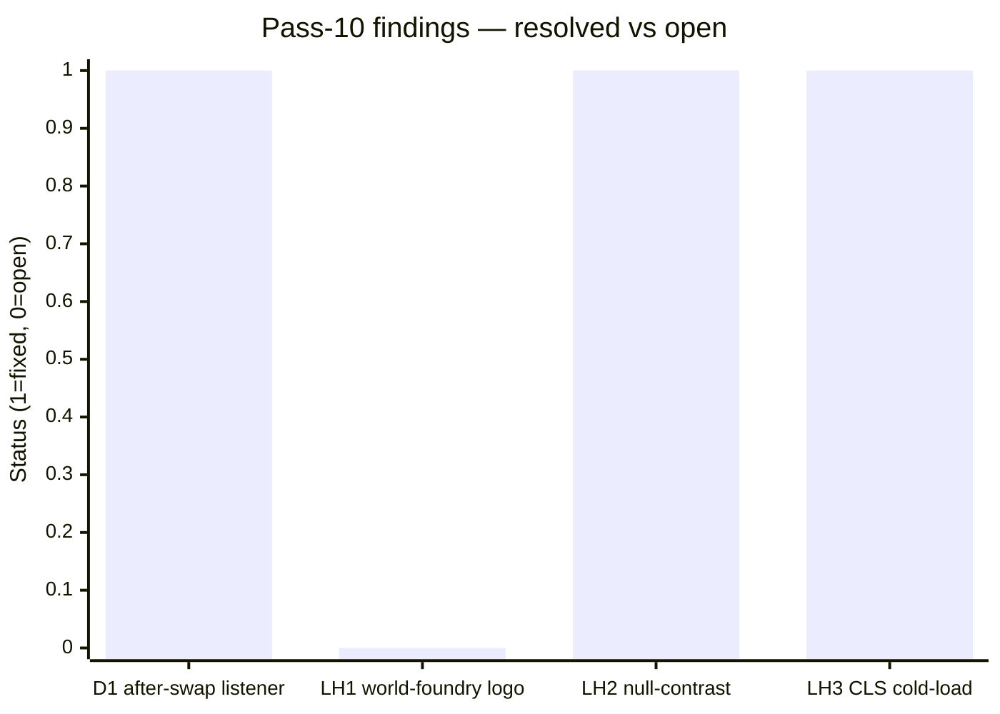
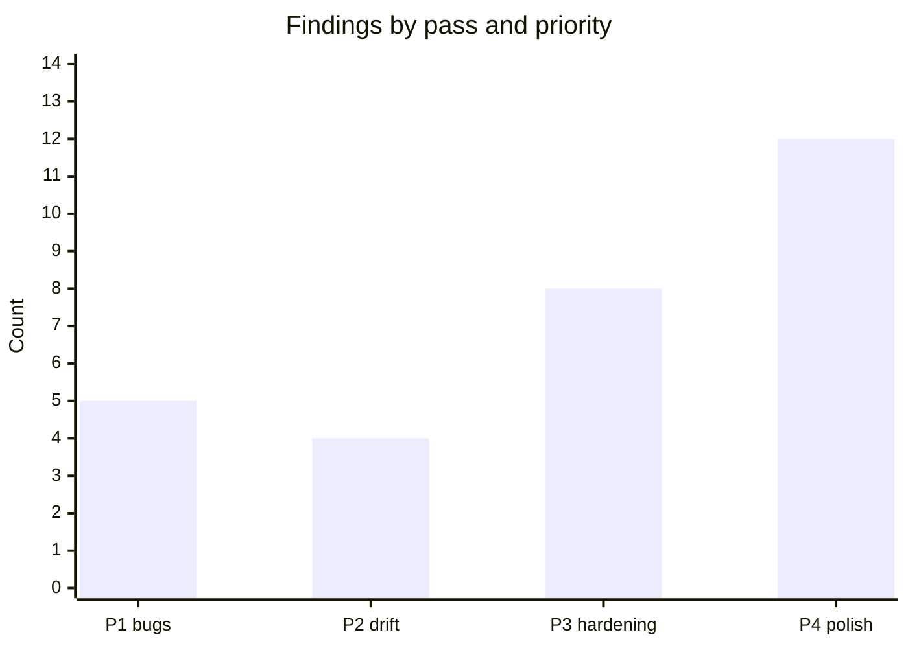

# Code review — indri.studio (pass 11, 2026-05-15)

Eleventh pass at current HEAD. Scope: `worker/index.ts` (Content Security Policy (CSP)
nonce injection, www→apex redirect, error boundary), `public/_headers` (route
coverage, header conflicts), `src/scripts/cca-lightbox.js` (keyboard
accessibility, ARIA, memory), `src/styles/global.css` (@theme completeness,
`@property` registration), `src/pages/index.astro` and `src/pages/404.astro`,
`src/content.config.ts` schema validators, `public/robots.txt`,
`public/site.webmanifest`, `src/components/MaterialSymbols.astro`,
`astro.config.mjs`.

## Pass-10 scorecard



| Finding | Description | Status |
|---|---|---|
| D1 | `astro:after-swap` registered inside `before-preparation` — listener accumulation on rapid nav | Fixed: both handlers now registered once at init via `pendingScroll` variable |
| LH1 | World Foundry logo source 108 px displayed at 338 px — `image-size-responsive` fails | **Open** — content fix (replace `logo.png` with ≥ 540 px source) |
| LH2 | A11y 95–96: `color-contrast` returns `null` for gradient backgrounds | Monitoring note — Lighthouse/axe limitation, actual ratio 10.2:1 (WCAG AAA) |
| LH3 | CLS 0.119 on parking-space cold-load run 1 | Monitoring note — median 0; font cold-cache noise |

---

## Findings: 3 (all P4)

### S1. `<dialog>` missing `aria-modal="true"`

[`src/content/apps/claude-code-authoring-formats.md:69`](../../src/content/apps/claude-code-authoring-formats.md):

```html
<!-- before -->
<dialog id="fm-lightbox" aria-label="Style preview">

<!-- after -->
<dialog id="fm-lightbox" aria-label="Style preview" aria-modal="true">
```

The lightbox is a native `<dialog>` element opened with `showModal()`. Native
`<dialog>` carries an implicit ARIA role of `dialog`, `aria-label="Style
preview"` provides an accessible name, and `showModal()` enforces DOM-level
modality (background is inert). Modern JAWS (2022+), NVDA (2022+), and
VoiceOver handle this correctly without the attribute.

`aria-modal="true"` is still the recommended belt-and-suspenders for assistive
technologies (ATs) that do not yet fully implement native `<dialog>` semantics
(primarily NVDA on Firefox ≤ 2021). Adding it costs zero runtime; omitting it
is not a bug on current AT versions. Fix opportunistically.

Keyboard and focus management are **already correct**: `showModal()` moves
focus to the first focusable child (`.fm-up`), arrow keys bubble through child
focus to the dialog's own `keydown` listener, `Escape` closes via the browser's
built-in handler, and the `close` event restores focus to the opener button.
The `aria-label` on the dialog and `aria-label` on each nav button are all
present.

### S2. No JSON-LD structured data on home or app pages

[`src/pages/index.astro`](../../src/pages/index.astro) and
[`src/pages/apps/[...slug].astro`](../../src/pages/apps/%5B...slug%5D.astro):

The home page is an `ItemList`-shaped app catalogue and the studio itself maps
cleanly to an `Organization` schema, but no `<script type="application/ld+json">`
is emitted anywhere. Adding `ItemList` for the home gallery and
`WebApplication` or `SoftwareApplication` for each app page would qualify for
rich results in Google Search and improve how link previews are rendered in
Slack, Discord, and messaging apps that parse JSON-LD. Priority is low — OG
tags cover most share-link use cases — but this is the largest unexploited SEO
surface in the codebase.

No fix in this pass; defer until after store launch when schema coverage matters.

### S3. Material Symbols FOIC window (decorative, no action needed)

[`src/components/MaterialSymbols.astro`](../../src/components/MaterialSymbols.astro):

The `media="print"` → `media="all"` idiom avoids render-blocking the Google
Fonts CSS while still loading it asynchronously. The inline `<script>` sets
`link.media = 'all'` synchronously in `<head>`, so the font file starts
downloading immediately after page parse — not gated on a load event. During
the download window, Material Symbols ligature text is invisible (font-display
is `block` in Google's generated CSS for variable axes). No layout shift occurs
because the icon containers have fixed 1 em × 1 em dimensions via
`src/styles/global.css`.

All icon ligatures across the codebase carry `aria-hidden="true"`, so there is
no semantic or accessibility impact. The FOIC window is purely visual and brief
on any reasonable connection. No action needed.

---

## What's confirmed correct (this pass)

| Area | Outcome |
|---|---|
| CSP nonce generation | 16-byte `crypto.getRandomValues()` → base64; 128-bit entropy; correct |
| CSP nonce injection | `HTMLRewriter` selector `"script"` stamps nonce on every `<script>` variant |
| Inline style CSP | `style-src 'unsafe-inline'` — CSP Level 1 fallback; inline `style=` attrs safe |
| www→apex redirect | All HTTP methods; path, query, and fragment preserved via `url.toString()` |
| Worker error boundary | `ASSETS.fetch()` unguarded — propagates as 500; acceptable default |
| `_headers` route coverage | `/_astro/*`, `/lh/*`, `/img/cca-styles/*`, favicon, manifest, robots; no overlap with worker |
| Lightbox ARIA | `<dialog aria-label="Style preview">`, all nav buttons labelled, `img.alt` set on render |
| Lightbox keyboard | `showModal()` auto-focuses `.fm-up`; arrow keys bubble to `dlg.keydown`; `Escape` built-in |
| Lightbox focus restore | `opener.focus()` on `close` event ✓ |
| Lightbox `urlFor()` | `TYPES` array is hardcoded; `style` from dataset; no path-traversal surface |
| `@property --header-shrink` | Registered: `syntax: "<number>"`, `inherits: true`, `initial-value: 0` ✓ |
| `color-mix()` browser support | Widely supported since 2023; no hard breakage on older browsers |
| Orphaned `@layer` blocks | None |
| `finding-your-way` sort | Comparator correctly pins it last; modulo wrap-around never self-links |
| 404 page | Correct layout, decorative image `alt=""`, eager lemur load ✓ |
| `content.config.ts` schema | URL fields validated; CSS injection guard (`/^[^;{}<>\\]+$/`) present; CSP comment accurate |
| `robots.txt` | `Disallow: /lh/`; sitemap URL correct; no drafts or private paths exposed |
| `site.webmanifest` | Valid icons (192, 512), `theme_color` and `background_color` match brand |
| `assetsInlineLimit: 0` scope | Correctly prevents `cca-lightbox.js` inlining; no unintended side-effects |
| MaterialSymbols `<noscript>` | Fallback `<link>` keeps icons working without JS ✓ |

---

## State of the review series

Eleven passes, 29 total findings:



| Priority | Count | All closed? |
|---|:---:|:---:|
| P1 — user-visible bugs | 5 | ✓ |
| P2 — doc/code drift | 4 | ✓ |
| P3 — hardening | 8 | LH1 open |
| P4 — style/polish | 12 | S1 in this pass; S2, S3, LH2, LH3 monitoring |

Active: fix **LH1** (world-foundry logo resolution) and **S1** (`aria-modal`
attribute). Both are content-layer edits with no build implications.
