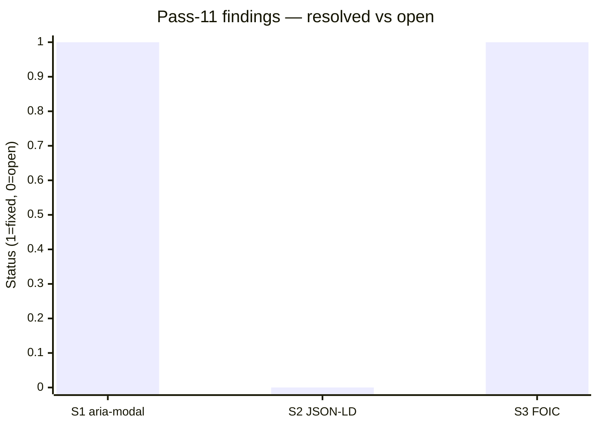
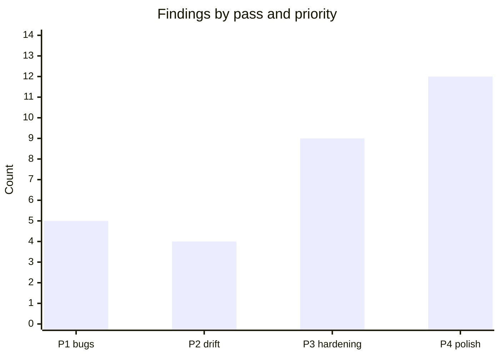

# Code review — indri.studio (pass 12, 2026-05-15)

Twelfth pass at current HEAD. Scope: `AppLayout.astro`, `Screenshot.astro`,
`ScrollToTop.astro` (full JS lifecycle), `RingFlare.astro`,
`src/pages/apps/[...slug].astro` (swipe gestures, prev/next wrap), all 8 app
content markdown files, `wrangler.toml`, `src/pages/colophon.astro`, and
verification of pass-10 open finding LH1 (world-foundry logo source size).

## Pass-11 scorecard



| Finding | Description | Status |
|---|---|---|
| S1 | `<dialog>` missing `aria-modal="true"` | Fixed in pass-11 commit |
| S2 | No JSON-LD structured data (`ItemList`, `Organization`) | Deferred to post-launch |
| S3 | Material Symbols FOIC window (decorative icons, no semantic impact) | Monitoring note |

**Also confirmed closed:** pass-10 LH1 (World Foundry logo 108 px displayed at 338 px).
Two subsequent commits (`fb1527a`, `a528c03`) removed the logo from the
`screenshots` array and added a dedicated `logo: image()` field to the content
schema. The logo now renders at its intrinsic 108×133 px via `<Image>` in the
page header, adjacent to the `<h1>`, rather than stretched to fill the
screenshot grid. The `image-size-responsive` Lighthouse (Lighthouse) audit
should pass on the next run.

---

## P3 — Hardening

### H1. ScrollToTop smooth-scroll animation not cancelled on navigation

[`src/components/ScrollToTop.astro:171–178`](../../src/components/ScrollToTop.astro):

```js
// current
document.addEventListener("astro:before-preparation", () => {
    eligible = false;
    const btn = button();
    if (btn) {
        btn.dataset.eligible = "false";
        btn.dataset.visible = "false";
    }
});
```

When a smooth-scroll animation is in-flight (user clicked the button, page is
animating toward `scrollY = 0`) and the user navigates before it completes, the
`step()` rAF (requestAnimationFrame) loop continues running across the page
transition. The `startY` closure captures the old page's scroll position; after
the swap `window.scrollY` resets to 0 but `y = round(startY × (1 − ease(t)))`
continues producing non-zero values for the remaining animation duration
(400–900 ms). Each frame calls `window.scrollTo(0, y)`, scrolling the new page
down from its initial position and fighting the `pendingScroll` restoration
written in `Base.astro`'s `astro:after-swap` handler.

The `activeAbort` controller is already present for exactly this purpose (it is
used to coalesce back-to-back clicks). It just needs to be invoked in
`before-preparation`:

```js
// after
document.addEventListener("astro:before-preparation", () => {
    if (activeAbort) activeAbort.abort();   // cancel any in-flight animation
    eligible = false;
    const btn = button();
    if (btn) {
        btn.dataset.eligible = "false";
        btn.dataset.visible = "false";
    }
});
```

When `activeAbort.abort()` fires, `aborted` is set to `true` inside the
`cancel` closure, all abort-signal listeners (`wheel`, `touchstart`,
`pointerdown`, `keydown`) are removed via `AbortSignal`, and the next `step()`
call returns immediately — stopping the animation before the swap.

---

## What's confirmed correct (this pass)

| Area | Outcome |
|---|---|
| `AppLayout.astro` prop threading | All props forwarded to Base; `ogImage`, `ogType`, `ringFlare=false` ✓ |
| Theme CSS injection safety | Values pass `cssSafe` regex (`/^[^;{}<>\\]+$/`) before reaching the template ✓ |
| `prevHref`/`nextHref` trailing slashes | Emitted as `/apps/${id}/` consistently ✓ |
| `Screenshot.astro` first-image strategy | `loading="eager" fetchpriority="high"` on `idx === 0` only ✓ |
| Screenshot `srcset`/`sizes` | Widths `[480, 720, 960, 1440]`; `sizes` covers mobile/tablet/desktop ✓ |
| `RingFlare.astro` | Pure CSS animation; no rAF loop; `aria-hidden="true"`; `prefers-reduced-motion` via CSS ✓ |
| `[...slug].astro` touch events | `{ passive: true }` on all touch listeners ✓ |
| `[...slug].astro` `pendingDir` scoping | Cleared on `astro:page-load`; no cross-nav leaks ✓ |
| Prev/next wrap-around | `posts[(i ± 1 + len) % len]` — correct modulo; no self-links ✓ |
| App markdown frontmatter | All 8 apps complete; schema fields valid; screenshot paths exist ✓ |
| Future-dated apps in gallery | Intentional: `draft: false` controls gallery inclusion; date controls "Launching Soon" badge ✓ |
| `world-foundry` logo alt | `<Image alt="">` adjacent to `<h1>World Foundry</h1>` — correct decorative treatment ✓ |
| `wrangler.toml` | `run_worker_first = true`; `not_found_handling = "404-page"`; no env overrides; `compatibility_date` current ✓ |
| `colophon.astro` | Base layout; all external attribution links valid; version references accurate ✓ |

---

## State of the review series

Twelve passes, 30 total findings:



| Priority | Count | All closed? |
|---|:---:|:---:|
| P1 — user-visible bugs | 5 | ✓ |
| P2 — doc/code drift | 4 | ✓ |
| P3 — hardening | 9 | H1 open |
| P4 — style/polish | 12 | S2 deferred post-launch; S3 monitoring |

Active: fix **H1** (`ScrollToTop` cancel on navigation). **S2** deferred to
post-launch. **S3**, **LH2**, **LH3** are permanent monitoring notes.
