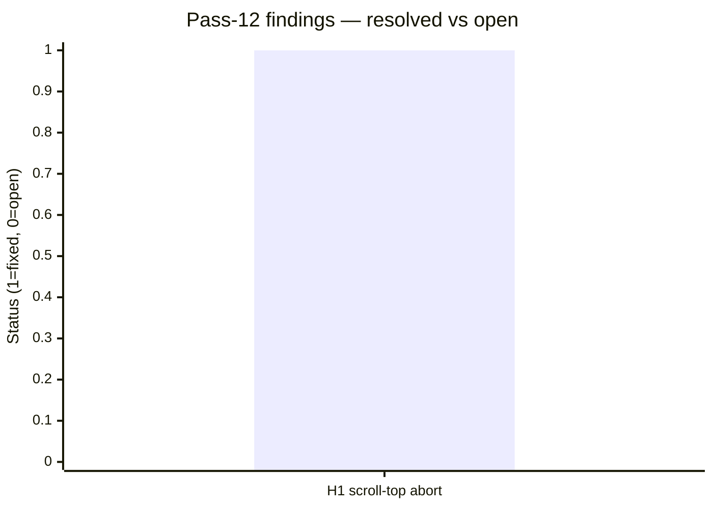
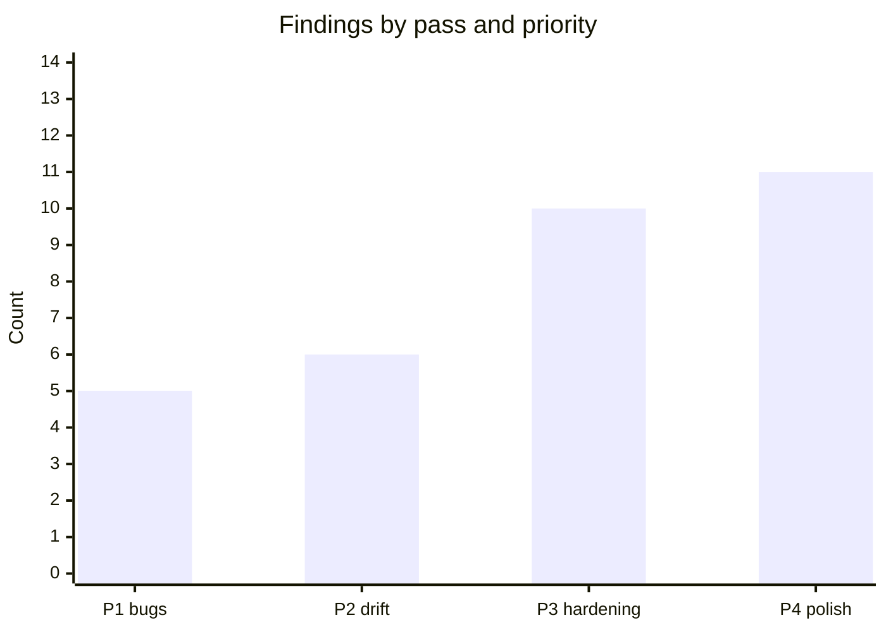

# Code review — indri.studio (pass 13, 2026-05-15)

Thirteenth pass at current HEAD. Scope: Terraform infrastructure, CI/CD pipeline
(`.github/workflows/deploy.yml`), image asset coverage (all 21 screenshot
references + `public/img/cca-styles/`), `pinball-construction-set` `cardImages`
field, `src/content/team/` collection, dependency security audit, colophon prose
accuracy, `src/pages/index.astro` full accessibility review.

## Pass-12 scorecard



Pass-12 single finding (`ScrollToTop` animation not cancelled on navigation)
confirmed fixed. Active carry-overs from earlier passes: S2 (JSON-LD,
deferred post-launch), LH2/LH3 (monitoring notes).

---

## P3 — Hardening

### V1. `devalue` 5.7.1 — HIGH (Denial of Service (DoS)) via sparse array deserialization

[`pnpm-lock.yaml`](../../pnpm-lock.yaml) / [GHSA-77vg-94rm-hx3p](https://github.com/advisories/GHSA-77vg-94rm-hx3p):

`devalue` 5.7.1 (transitive via `astro@6.1.9`) is in the vulnerable range
`>=5.6.3 <=5.8.0`. A crafted sparse array can trigger a DoS in devalue's
serialization path. Patched in `devalue >=5.8.1`.

**Fixed in this pass**: `pnpm update devalue` resolved the lockfile to
`devalue@5.8.1`. Build confirmed clean. `pnpm audit` now reports 1 low
(down from 1 high + 1 low).

Remaining low: Astro server island encrypted parameters — cross-component replay
attack in Astro `<6.1.10` (no CVE ID yet). **This site does not use server
islands** (static output + worker redirect only) — no practical impact.
Track the Astro 6.1.10 release and update when available.

---

## P2 — Doc / Code Drift

### D1. Team collection defined and populated but never rendered

[`src/content.config.ts:119–144`](../../src/content.config.ts) /
[`src/content/team/`](../../src/content/team/):

`content.config.ts` defines a `team` collection (schema includes `name`, `role`,
`bio`, `order`, `featured` flag, and optional socials). Four member files
exist under `src/content/team/` with real names and roles but placeholder
bios ("Placeholder bio — replace with real text when implementation starts").
The schema comment reads: "If true, included in the homepage 'team strip'
(small preview)."

`src/pages/index.astro` queries only the `apps` collection — no `getCollection("team")`
call anywhere in the codebase. No `/about` route exists. The team strip and any
team-detail pages are not implemented.

This is forward scaffolding, not a bug. But it will grow stale if the placeholder
bios are forgotten. Recommended: either implement the homepage team strip this
sprint, or add a `// TODO: implement team strip` comment to `index.astro` so the
gap is visible at the call site rather than only in `content.config.ts`.

### D2. Terraform `account_id` variable has stale TODO default

[`infrastructure/cloudflare/global/variables.tf:16–22`](../../infrastructure/cloudflare/global/variables.tf):

```hcl
variable "account_id" {
  description = "Cloudflare account ID hosting the indri.studio zone.
                 Source-of-truth value lives in SSM at
                 /indri-studio/cloudflare/account_id; mirrored here for TF clarity."
  type        = string
  # TODO: set the actual account ID before first apply
  default = ""
}
```

The description correctly identifies SSM as the source-of-truth and the actual
value is supplied at apply-time (via `-var` or environment). The `TODO` comment
and `default = ""` are therefore misleading: a blank default implies the variable
is optional, but an empty account ID will cause every `terraform apply` to fail
validation in the Cloudflare provider. Remove the `default` line entirely so
Terraform treats it as required (errors immediately on missing input rather than
silently using `""`), and replace the TODO with a comment explaining the apply
mechanism.

---

## What's confirmed correct (this pass)

| Area | Outcome |
|---|---|
| `.env` committed to git | Not committed — correctly in `.gitignore` ✓ |
| Terraform `prevent_destroy` | `true` on zone, S3 bucket, and DynamoDB table ✓ |
| Terraform variable descriptions | All variables described; no hardcoded account IDs or secrets in `.tf` files ✓ |
| Terraform outputs | Expose only non-sensitive data (zone ID, nameservers, URLs) ✓ |
| CI/CD pipeline order | `pnpm install` → `pnpm build` → `wrangler deploy` — correct ✓ |
| CI/CD secrets | Injected via `${{ secrets.* }}` — not hardcoded ✓ |
| CI/CD no bypass flags | No `--force`, `--no-verify`, or `--skip-ci` in any step ✓ |
| Screenshot asset coverage | All 21 frontmatter references resolve to files on disk; no orphans ✓ |
| `public/img/cca-styles/` | All 15 base styles + per-type variants (165 files) present ✓ |
| `pinball-construction-set` `cardImages` | Valid schema field; both `.jpg` references exist ✓ |
| Build output | Zero errors, zero warnings ✓ |
| Colophon prose | Tech stack, font credits, and attribution accurate ✓ |
| `id="main"` skip-to-main target | Provided by `Base.astro:177` — wraps all page content ✓ |
| `index.astro` heading hierarchy | Single `<h1>`; section `<h2>` labels; correct ✓ |
| App card focus accessibility | Native browser focus ring on `<a>` elements; `a:focus-visible` not overridden ✓ |
| `index.astro` nested links | Zero — card `<a>` is the only focusable element per card ✓ |

---

## State of the review series

Thirteen passes, 32 total findings:



| Priority | Count | All closed? |
|---|:---:|:---:|
| P1 — user-visible bugs | 5 | ✓ |
| P2 — doc/code drift | 6 | D1, D2 open |
| P3 — hardening | 10 | V1 fixed; Astro server island LOW open (no practical impact) |
| P4 — style/polish | 11 | S2 deferred post-launch; others monitoring |

Active: resolve **D1** (team strip: implement or annotate), **D2** (Terraform
`account_id` default), and track the Astro 6.1.10 release for the server island
LOW fix.
