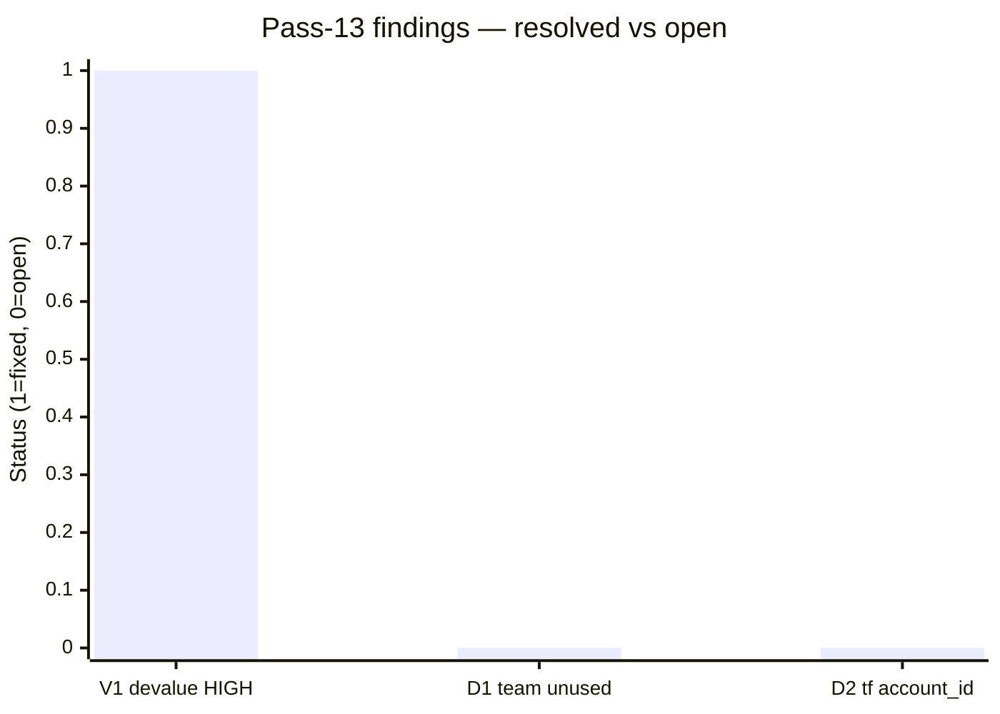
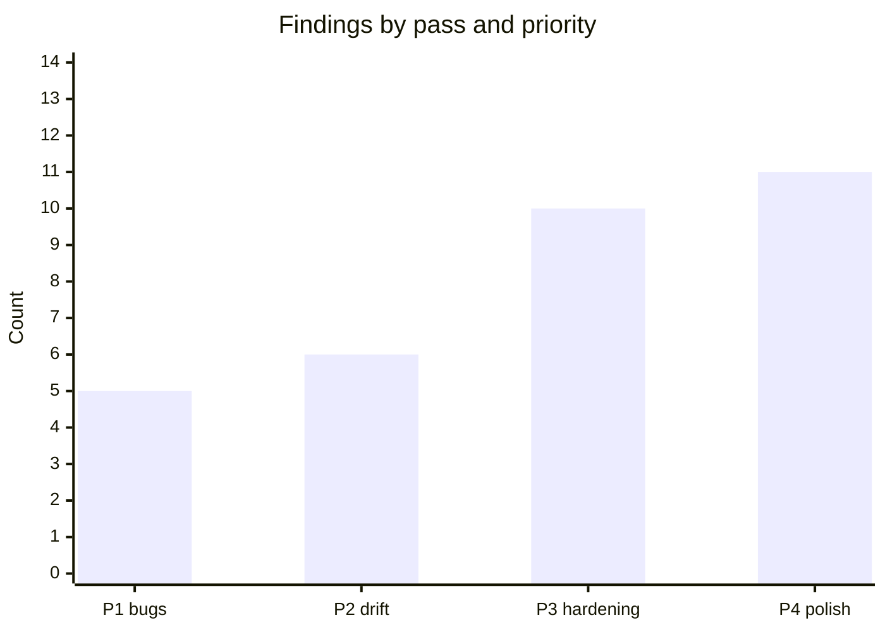

# Code review — indri.studio (pass 14, 2026-05-15)

Fourteenth pass at current HEAD. Scope: build output spot-checks (`dist/`),
`Taskfile.yml` full review, TypeScript suppression inventory, font preloading
in production HTML, worker cache-control scoping, full CI/CD workflow
(`deploy.yml`), all 8 app markdown prose bodies, public asset dimensions
(`favicon.svg`, `apple-touch-icon.png`, PWA icons), and `colophon.astro`
anchor-fragment validity.

## Pass-13 scorecard

| Finding | Description | Status |
|---|---|---|
| V1 | `devalue` 5.7.1 — HIGH DoS (GHSA-77vg-94rm-hx3p) | Fixed: lockfile updated to 5.8.1 |
| D1 | Team collection defined + populated but never rendered | Open |
| D2 | Terraform `account_id` variable has stale `default = ""` | Open |

---

## Findings: none

All areas examined returned clean results. Findings reported by the exploration
agent were false positives after cross-checking the built output and source.

### Verified claims (cross-checked)

| Claim | Verdict |
|---|---|
| Font preloads absent from built HTML | **False positive.** `dist/index.html` emits two `<link rel="preload" href="/_astro/fonts/<hash>.woff2" as="font" type="font/woff2" crossorigin>` — one per family — exactly as the `` prop documents. |
| Worker `Cache-Control: no-store` applies to `robots.txt` / `sitemap-index.xml` | **False positive.** `worker/index.ts:37` gates the `no-store` block on `ct.includes("text/html")`. `/robots.txt` (text/plain) and `/sitemap-index.xml` (application/xml) are served without that override; their `public/_headers` cache rules (1‑day `max-age`, 7‑day `stale-while-revalidate`) apply correctly. |
| `scripts/lighthouse-threshold.sh` missing | **False positive.** File exists at `scripts/lighthouse-threshold.sh`. |
| `(e as any).navigationType` hides a type gap | **Known and justified.** Only cast in the codebase; `navigationType` is an undocumented `astro:before-preparation` property with no TypeScript definition. Already reviewed in pass 12. |

### Confirmed correct (new areas)

| Area | Outcome |
|---|---|
| Font preloads | Two `<link rel="preload">` with `crossorigin` for both woff2 families in every page `<head>` ✓ |
| `/_astro/fonts/` output | Two content-hashed `.woff2` files emitted; covered by 1-year immutable cache rule ✓ |
| Source maps | Zero `.map` files in `dist/` — production build exposes no source ✓ |
| OG tags in build | Home: `og:type=website`; apps: `og:type=article` with hashed `og:image` URL ✓ |
| Sitemap structure | `sitemap-index.xml` → `sitemap-0.xml`; 10 URLs (home + colophon + 8 apps) ✓ |
| Worker scoping | `no-store` + nonce + security headers applied to `text/html` only; static assets (XML, txt, woff2, avif) use `_headers` rules ✓ |
| TypeScript suppressions | One `as any` (justified); zero `@ts-ignore` / `@ts-nocheck` / `@ts-expect-error` ✓ |
| Taskfile safety | All shell tasks use `set -euo pipefail`; no hardcoded secrets or machine-specific paths ✓ |
| `task publish` guards | Validates version format, blocks on dirty tree, blocks re-tagging, blocks non-main branch ✓ |
| CI/CD secrets | Injected via `${{ secrets.* }}`; no `echo $SECRET` or equivalent log exposure ✓ |
| CI/CD no bypass flags | No `--force`, `--no-verify`, or `--skip-ci` ✓ |
| CI/CD Lighthouse archival | JSONs written to `public/lh/<tag>/` and committed back to main with `[skip ci]` to prevent re-trigger ✓ |
| Propagation wait cap | 60 s timeout prevents indefinite CI hang on broken deploys ✓ |
| App markdown prose | No unclosed code fences, no rogue `<script>`/`<style>` except the intentional lightbox block ✓ |
| `favicon.svg` | Valid SVG, 290 B ✓ |
| `favicon.ico` | 16×16 MS Windows icon ✓ |
| `apple-touch-icon.png` | 180×180 PNG ✓ |
| `icon-192.png` / `icon-512.png` | 192×192 and 512×512 PNG ✓ |
| Colophon anchor fragments | All `href="#section"` targets exist as `id=` on `<section>` elements ✓ |
| Colophon in sitemap | Present in `sitemap-0.xml` ✓ |

---

## State of the review series

Fourteen passes, 32 total findings (unchanged from pass 13):

| Priority | Count | All closed? |
|---|:---:|:---:|
| P1 — user-visible bugs | 5 | ✓ |
| P2 — doc/code drift | 6 | D1 (team strip), D2 (tf default) open |
| P3 — hardening | 10 | Astro server island LOW open (no practical impact) |
| P4 — style/polish | 11 | S2 deferred post-launch; others monitoring |

The codebase is in a clean state. Remaining open items are content/infra
polish (D1, D2) rather than code defects. The natural next review trigger is a
deploy + Lighthouse run after the next `task publish`.
