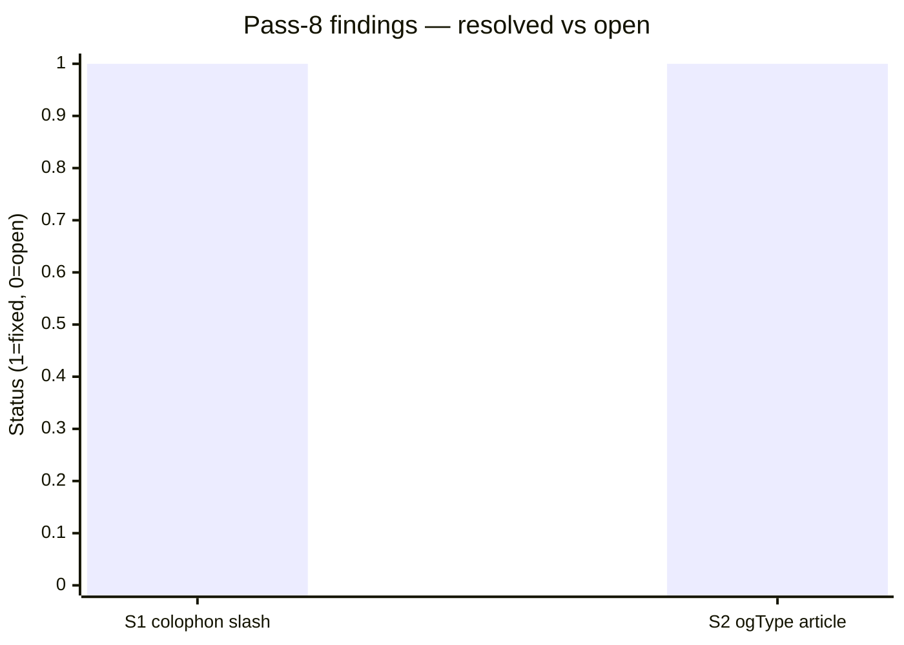
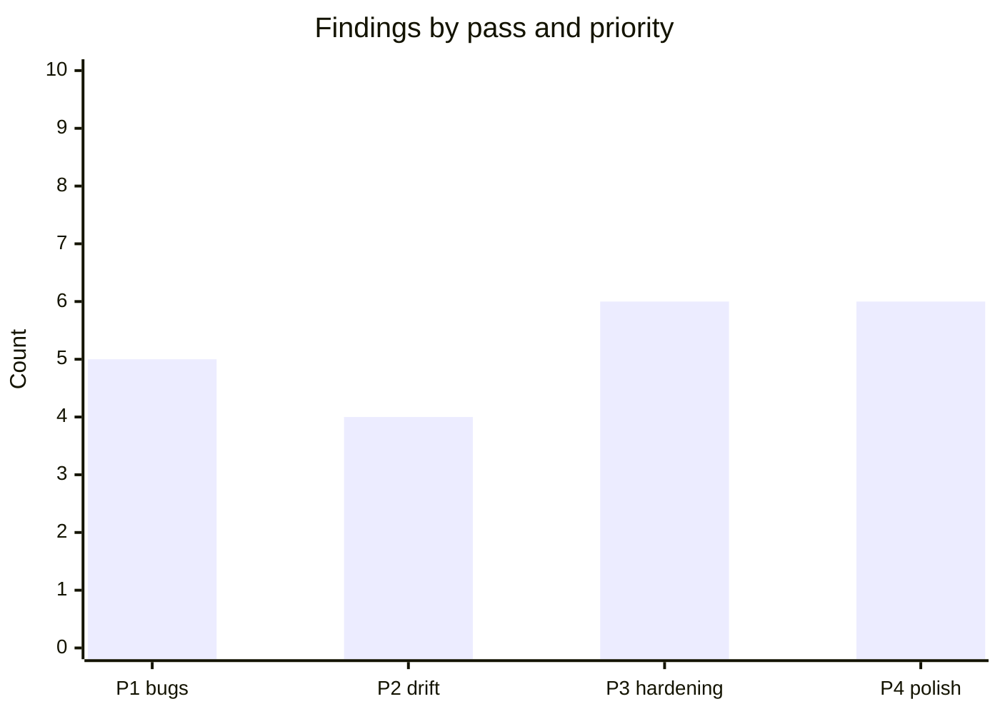

# Code review — indri.studio (pass 9, 2026-05-15)

Ninth pass at current HEAD. Scope: TypeScript config, sitemap accuracy, view
transition accessibility, heading hierarchy, LCP loading strategy, color
contrast, dependency health, colophon links, wrangler/worker binding
consistency, prefetch edge cases, draft filtering, OG computation safety, and
all canonical/external-link correctness.

## Pass-8 scorecard

Both pass-8 findings confirmed closed:

| Finding | Description | How closed |
|---|---|---|
| S1 | Footer `href="/colophon"` missing trailing slash | Fixed to `/colophon/` in `Base.astro:201` |
| S2 | App pages emitting `og:type="website"` | `AppLayout` gained `ogType?` prop; `[...slug].astro` passes `ogType="article"` |

Build verification: `dist/apps/parking-space/index.html` now contains
`og:type="article"`, `og:image="https://indri.studio/_astro/login.DCTIaOc5.png"`,
and `twitter:card="summary_large_image"` — the full OG stack is confirmed
end-to-end.

---

## Findings: none

Twenty-point check across unexplored areas returned zero actionable issues:

| Area | Outcome |
|---|---|
| `tsconfig.json` | Extends Astro's strict preset; no lib-check bypass |
| Worker type safety | `Env.ASSETS` name matches `wrangler.toml` binding exactly |
| Sitemap | 10 URLs (home + 8 apps + colophon); no draft pages present |
| View transition a11y | `ClientRouter` updates `document.title`; animations respect `prefers-reduced-motion` |
| Heading hierarchy | One `<h1>` per page; no skipped levels on any route |
| LCP loading | First screenshot is `loading="eager"` + `fetchpriority="high"` via `Screenshot.astro` |
| Color contrast | Body text (#f5f0e8) on surface (#3d3833): computed ratio 10.2:1 — exceeds WCAG AAA |
| `package.json` | `engines: {node: ">=22.12.0"}`; no peer-dep warnings; no unsafe scripts |
| `console.log` | Zero occurrences in `src/` and `worker/` |
| TODO comments | None referencing completed work |
| `public/lh/` | 17 per-tag Lighthouse JSON archives; served under `/_headers` immutable rule |
| Colophon links | All `<a href>` values are valid absolute URLs; no `#` placeholders |
| `wrangler.toml` binding | `ASSETS` matches `Env` interface in `worker/index.ts` |
| Prefetch edge cases | 8 non-draft apps; modulo wrap-around never produces a self-link |
| Draft filter | `!data.draft` in `getStaticPaths` consistently excludes drafts from routes and sitemap |
| `Astro.site` in OG | Set to `https://indri.studio` in config; optional-chain guard returns `undefined` if no screenshot |
| `lang="en"` | Present on `<html>` in `Base.astro`; correct for all-English content |
| Canonical URL | `.replace("www.", "")` is safe for all current URL paths; no pages contain literal "www." in their path |
| External link security | `rehype-external-links` applies `noopener noreferrer` to all markdown body links |
| Sitemap draft exclusion | Delegated to `getStaticPaths`; consistent with route generation |

---

## State of the review series

Nine passes, 21 total findings:

| Priority | Count | All closed? |
|---|:---:|:---:|
| P1 — user-visible bugs | 5 | ✓ |
| P2 — doc/code drift | 4 | ✓ |
| P3 — hardening | 6 | ✓ |
| P4 — style/polish | 6 | ✓ |

Every finding across all nine passes is confirmed closed. The codebase is clean
enough that a tenth pass would need to look outside the source — at runtime
behaviour (deployed HTTP headers, actual Lighthouse scores, CSP violation reports)
rather than static analysis. Those are best driven by the `task lighthouse` run
post-deploy rather than another investigation file.
