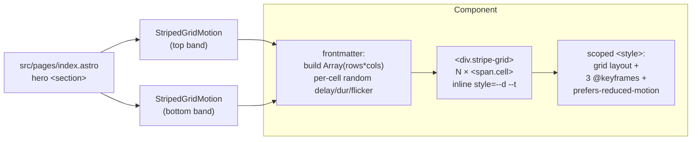

# Plan: StripedGridMotion component for indri.studio hero

## Context

The indri.studio canonical plan (`~/SRC/indri.studio/docs/plans/2026-05-13-initial-buildout.md`) calls for **subtle ringtail-stripe motion in 1–2 zones of the homepage hero** — the signature visual element of the brand. The scaffold left a placeholder at `src/pages/index.astro:35-36`:

```
<!-- Hero background. The body's purple dot grid shows through; the
     ringtail-stripe motion module will land here later (plan §Motion). -->
```

This sub-plan replaces that placeholder. Everything else on the homepage is structural / typographic; this is the one piece that has to feel right.

Design intent (from the canonical plan):
- **Motion**: pixel grid of ~16–24 px cells in 5–15 % accent-tinted dark; individual cells slowly drift opacity / tint on staggered timers; confined to hero + one interior strip; pure CSS where possible; honour `prefers-reduced-motion: reduce`.
- **Stripe motif**: pixel-grid motion arranged in horizontal stripe rows, alternating cell density / opacity between rows; occasional neon-purple cells flicker across as accents — "the lemur's tail in the UI furniture".
- **Mockup**: hero is bracketed by two motion stripes — one above the headline, one below the tagline.

> **Implementation note** — this remote planning session does not have `~/SRC/indri.studio/` checked out. Before editing, the implementer should verify (a) the placeholder lines in `index.astro`, (b) the CSS token names in `src/styles/global.css`, and (c) the hero `<section>` already has `relative overflow-hidden`. If any differ, adapt and proceed; the design below stands.

## Approach

**Pure-CSS, build-time-randomised, server-rendered Astro component.** No runtime JS, no canvas, no client hydration. Cells are `<span>` elements in a CSS grid; each gets a randomised animation `delay` and `duration` injected as inline custom properties at render time. The randomisation breaks the gridded marching-band look without shipping any JS.

Astro renders the frontmatter independently per component instance, so the two hero bands get independent random patterns from a single component — no extra plumbing.

Rejected alternatives:
- **Canvas + JS** — ships JS for a decorative element; overkill at this cell count.
- **SVG `<animate>`** — heavier per-element runtime than CSS animations.
- **Hard-coded modulo delays** — the repeating pattern is visible to the eye.

## Shape



Each band runs frontmatter once → produces its own randomised cell array → renders → CSS animations take over. No JS in the output.

## Files

### New
- `src/components/StripedGridMotion.astro` (~80 LOC including styles)

### Modified
- `src/pages/index.astro` — replace the placeholder comment (lines 35–36) with two `<StripedGridMotion />` instances bracketing the hero content; add the import.

## Component

```astro
---
// src/components/StripedGridMotion.astro
interface Props {
  rows?: number;        // default 4
  cols?: number;        // default 60
  cellSize?: number;    // px, default 18
  flickerRate?: number; // fraction of cells that pulse purple, default 0.03
  class?: string;       // wrapper classes for positioning
}

const {
  rows = 4,
  cols = 60,
  cellSize = 18,
  flickerRate = 0.03,
  class: extraClass = "",
} = Astro.props;

// Per-cell randomised timing. Astro re-runs frontmatter per instance,
// so each band gets an independent pattern. Stable per render (build-time
// for SSG, request-time for SSR — both fine for decoration).
const cells = Array.from({ length: rows * cols }, (_, i) => {
  const row = Math.floor(i / cols);
  const dense = row % 2 === 0;                            // alternating stripe density
  const delay = (Math.random() * 6).toFixed(2);
  const duration = (3 + Math.random() * 4).toFixed(2);
  const flicker = Math.random() < flickerRate;
  return { dense, delay, duration, flicker };
});
---

<div class:list={["stripe-grid", extraClass]} aria-hidden="true">
  {cells.map((c) => (
    <span
      class:list={["cell", c.dense ? "dense" : "sparse", c.flicker && "flicker"]}
      style={`--d:${c.delay}s; --t:${c.duration}s;`}
    />
  ))}
</div>

<style define:vars={{ cols, cellSize: `${cellSize}px` }}>
  .stripe-grid {
    display: grid;
    grid-template-columns: repeat(var(--cols), var(--cellSize));
    grid-auto-rows: var(--cellSize);
    width: 100%;
    overflow: hidden;
    pointer-events: none;
    /* Fade horizontal edges so the grid doesn't hard-cut at the viewport */
    -webkit-mask-image: linear-gradient(to right, transparent, black 10%, black 90%, transparent);
            mask-image: linear-gradient(to right, transparent, black 10%, black 90%, transparent);
  }
  .cell {
    background: var(--color-grey-700);
    opacity: 0;
    animation: pulse-dense var(--t) ease-in-out var(--d) infinite alternate;
  }
  .cell.sparse {
    animation: pulse-sparse calc(var(--t) * 1.5) ease-in-out var(--d) infinite alternate;
  }
  .cell.flicker {
    background: var(--color-primary-container);
    animation: pulse-flicker calc(var(--t) * 0.8) ease-in-out var(--d) infinite alternate;
  }
  @keyframes pulse-dense  { 0% { opacity: 0; } 100% { opacity: 0.14; } }
  @keyframes pulse-sparse { 0% { opacity: 0; } 100% { opacity: 0.06; } }
  @keyframes pulse-flicker {
    0%   { opacity: 0;    }
    50%  { opacity: 0.40; }
    100% { opacity: 0;    }
  }
  @media (prefers-reduced-motion: reduce) {
    .cell         { animation: none; opacity: 0.05; }
    .cell.flicker { animation: none; opacity: 0.25; }
  }
</style>
```

Notes:
- `define:vars` only carries values used in CSS; `rows` doesn't need to cross over (it just controls the JS loop length).
- `class:list` accepts the `falsy && "name"` pattern cleanly.
- `repeat(var(--cols), ...)` with a custom property is supported in all evergreen browsers.

## Hero integration

In `src/pages/index.astro`:

1. Add the import alongside existing component imports:
   ```ts
   import StripedGridMotion from "../components/StripedGridMotion.astro";
   ```
2. Replace lines 35–36 (the placeholder comment) with two instances bracketing the existing hero content. Hero content gets `relative z-10`; bands get `absolute … z-0`.

Conceptual structure after the edit:
```astro
<section class="relative overflow-hidden ... min-h-[600px]">
  <StripedGridMotion class="absolute left-0 right-0 top-6 z-0" />
  <div class="relative z-10 ...">
    {/* pill + h1 + tagline — unchanged */}
  </div>
  <StripedGridMotion class="absolute left-0 right-0 bottom-6 z-0" />
</section>
```

If the existing hero doesn't already have `relative overflow-hidden`, add them — without `relative` the absolute children escape the section; without `overflow-hidden` the mask-faded edges spill past the viewport edge on narrow screens.

## Tokens

From `src/styles/global.css` (verify names — substitute equivalents if the scaffold uses different identifiers):
- `--color-grey-700` (`#3D3833`) — base cell tint
- `--color-primary-container` (`#B026FF`) — flicker accent

No new tokens.

## Performance budget

- Default: 4 rows × 60 cols × 2 instances = **480 cells**.
- `opacity`-only animation → compositor-only, no layout/paint cost. Handles 1000+ cells comfortably on modern phones.
- If DevTools Performance shows FPS dipping on low-end mobile, drop `cols` to 40 first; `rows` second.

## Verification

1. **Build clean.** `pnpm build` — no warnings; page count unchanged (7).
2. **Dev preview.** `pnpm dev`; `http://localhost:4321/` shows two stripe bands bracketing the "indri" headline. Subtle — no eye-grabbing motion, no hard edges (mask fade visible at the viewport sides).
3. **Stripe motif.** DevTools → inspect `.cell.dense` vs `.cell.sparse` — confirm alternating row classes. Eye test: dense rows brighter than sparse rows.
4. **Purple flicker.** Watch ~30 s of the hero; ~3 % of cells (≈14 of 480) cycle through purple at any time.
5. **Reduced motion.** macOS System Settings → Accessibility → "Reduce motion" ON, reload. Animation stops; cells settle to `opacity: 0.05` (and flicker cells to `0.25`). Verify via DevTools Computed styles.
6. **Mobile.** `pnpm dev --host`, open on phone. No horizontal scrollbar; mask fade renders on narrow viewports (the `-webkit-mask-image` prefix matters for older iOS Safari).
7. **No JS shipped.** View page source — no `<script>` added for this component. (Astro components without `client:*` directives are server-only HTML+CSS.)

## Out of scope

- The **second interior-strip zone** mentioned in the canonical plan. Same component, future placement — no code changes needed.
- Per-app motion variations (different accent colour on per-app landing pages). When that lands, override via a wrapper class — `.my-app-motion .cell.flicker { background: var(--color-app-accent); }` — rather than forking the component.
- Light-mode variant — site is dark-only.
