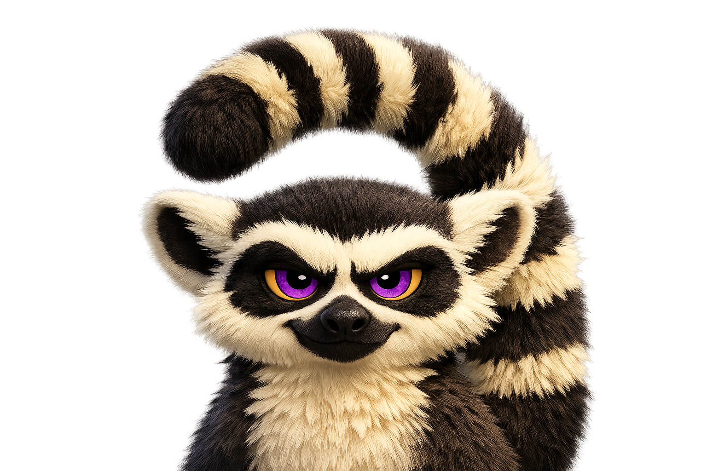
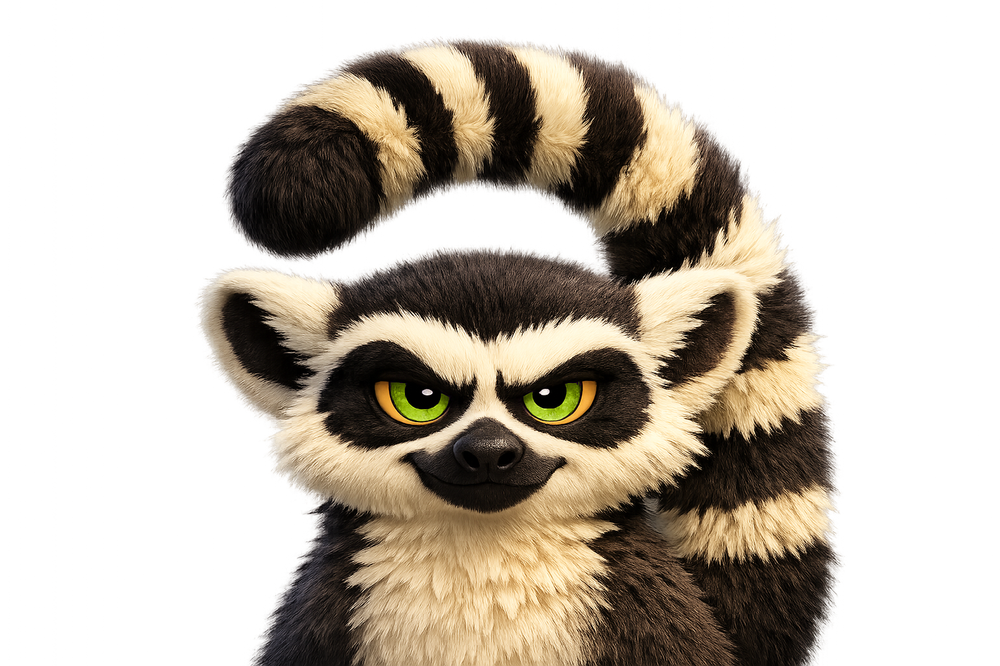

# indri.studio: replace Phosphor purple with indri-eye green

## Goal

Replace the brand's Phosphor neon purple with a green inspired by indri lemur eye
colour, and update the mascot lemur's eye irises to match real indri lemur eyes.

## Reference: indri lemur eyes

Real indri (*Indri indri*) eyes are a vivid, luminous yellow-green — chartreuse, almost
phosphor-bright. The new brand accent mirrors that quality.

### Before

Purple iris, dark pupil, amber outer ring:



### After

Indri-eye green iris, dark pupil, amber outer ring preserved:



---

## Colour decisions

### Accent: before → after

<table>
<tr>
  <td><span style="display:inline-block;width:48px;height:48px;background:#b026ff;border-radius:6px;vertical-align:middle;border:1px solid rgba(255,255,255,.15)"></span></td>
  <td style="padding-left:12px"><strong>#B026FF</strong> — Phosphor neon purple (old)</td>
</tr>
<tr>
  <td><span style="display:inline-block;width:48px;height:48px;background:#b8ef00;border-radius:6px;vertical-align:middle;border:1px solid rgba(255,255,255,.15)"></span></td>
  <td style="padding-left:12px"><strong>#B8EF00</strong> — Indri-eye neon green (new)</td>
</tr>
</table>

### Full primary token mapping

| Token | Old (purple) | | New (green) | |
|-------|-------------|---|------------|---|
| `--color-primary` | `#ddb3ff` | <span style="display:inline-block;width:32px;height:16px;background:#ddb3ff;border-radius:3px;vertical-align:middle;border:1px solid rgba(0,0,0,.2)"></span> | `#d4ffa0` | <span style="display:inline-block;width:32px;height:16px;background:#d4ffa0;border-radius:3px;vertical-align:middle;border:1px solid rgba(0,0,0,.2)"></span> |
| `--color-on-primary` | `#3a004b` | <span style="display:inline-block;width:32px;height:16px;background:#3a004b;border-radius:3px;vertical-align:middle;border:1px solid rgba(255,255,255,.2)"></span> | `#1a3000` | <span style="display:inline-block;width:32px;height:16px;background:#1a3000;border-radius:3px;vertical-align:middle;border:1px solid rgba(255,255,255,.2)"></span> |
| `--color-primary-container` | `#b026ff` | <span style="display:inline-block;width:32px;height:16px;background:#b026ff;border-radius:3px;vertical-align:middle;border:1px solid rgba(255,255,255,.2)"></span> | `#b8ef00` | <span style="display:inline-block;width:32px;height:16px;background:#b8ef00;border-radius:3px;vertical-align:middle;border:1px solid rgba(0,0,0,.2)"></span> |
| `--color-on-primary-container` | `#1a002b` | <span style="display:inline-block;width:32px;height:16px;background:#1a002b;border-radius:3px;vertical-align:middle;border:1px solid rgba(255,255,255,.2)"></span> | `#0d1a00` | <span style="display:inline-block;width:32px;height:16px;background:#0d1a00;border-radius:3px;vertical-align:middle;border:1px solid rgba(255,255,255,.2)"></span> |
| `--color-primary-fixed` | `#ddb3ff` | <span style="display:inline-block;width:32px;height:16px;background:#ddb3ff;border-radius:3px;vertical-align:middle;border:1px solid rgba(0,0,0,.2)"></span> | `#d4ffa0` | <span style="display:inline-block;width:32px;height:16px;background:#d4ffa0;border-radius:3px;vertical-align:middle;border:1px solid rgba(0,0,0,.2)"></span> |
| `--color-primary-fixed-dim` | `#b026ff` | <span style="display:inline-block;width:32px;height:16px;background:#b026ff;border-radius:3px;vertical-align:middle;border:1px solid rgba(255,255,255,.2)"></span> | `#b8ef00` | <span style="display:inline-block;width:32px;height:16px;background:#b8ef00;border-radius:3px;vertical-align:middle;border:1px solid rgba(0,0,0,.2)"></span> |
| `--color-on-primary-fixed` | `#1a002b` | <span style="display:inline-block;width:32px;height:16px;background:#1a002b;border-radius:3px;vertical-align:middle;border:1px solid rgba(255,255,255,.2)"></span> | `#0d1a00` | <span style="display:inline-block;width:32px;height:16px;background:#0d1a00;border-radius:3px;vertical-align:middle;border:1px solid rgba(255,255,255,.2)"></span> |
| `--color-on-primary-fixed-variant` | `#5b00a3` | <span style="display:inline-block;width:32px;height:16px;background:#5b00a3;border-radius:3px;vertical-align:middle;border:1px solid rgba(255,255,255,.2)"></span> | `#3d6800` | <span style="display:inline-block;width:32px;height:16px;background:#3d6800;border-radius:3px;vertical-align:middle;border:1px solid rgba(255,255,255,.2)"></span> |
| `--color-inverse-primary` | `#6c00b0` | <span style="display:inline-block;width:32px;height:16px;background:#6c00b0;border-radius:3px;vertical-align:middle;border:1px solid rgba(255,255,255,.2)"></span> | `#527000` | <span style="display:inline-block;width:32px;height:16px;background:#527000;border-radius:3px;vertical-align:middle;border:1px solid rgba(255,255,255,.2)"></span> |

### Favicon: before → after

Current — dark dome + vivid purple body; eyes are nearly-black dark purple `#3a004b`:

```
Body:  #b026ff  ████  Dome fill (the lemur head silhouette)
Eyes:  #3a004b  ████  Eye circles (very dark, unreadable at small size)
```

New — dark forest-green dome + vivid indri-eye circles:

```
Body:  #2d5200  ████  Dark forest green (indri fur reads as dark)
Eyes:  #b8ef00  ████  Vivid chartreuse — the signature indri eye colour
```

<table>
<tr><th>Part</th><th>Old</th><th></th><th>New</th><th></th></tr>
<tr>
  <td>Dome body</td>
  <td><code>#b026ff</code></td>
  <td><span style="display:inline-block;width:32px;height:16px;background:#b026ff;border-radius:3px;vertical-align:middle;border:1px solid rgba(255,255,255,.2)"></span></td>
  <td><code>#2d5200</code></td>
  <td><span style="display:inline-block;width:32px;height:16px;background:#2d5200;border-radius:3px;vertical-align:middle;border:1px solid rgba(255,255,255,.2)"></span></td>
</tr>
<tr>
  <td>Eye circles</td>
  <td><code>#3a004b</code></td>
  <td><span style="display:inline-block;width:32px;height:16px;background:#3a004b;border-radius:3px;vertical-align:middle;border:1px solid rgba(255,255,255,.2)"></span></td>
  <td><code>#b8ef00</code></td>
  <td><span style="display:inline-block;width:32px;height:16px;background:#b8ef00;border-radius:3px;vertical-align:middle;border:1px solid rgba(0,0,0,.2)"></span></td>
</tr>
</table>

### Mascot PNG: eye iris change

The eye irises in `src/assets/mascot-lemur.png` are currently vivid purple
(~HSV hue 280–300°). Python + PIL hue-rotates the purple band to chartreuse-green
(~HSV hue 70–80°) at matching saturation/value. The yellow/amber outer ring and
dark pupils are outside that hue range and are left untouched.

---

## Files changed

1. `src/styles/global.css` — primary tokens + neon rgba glow colours + comments
2. `public/favicon.svg` — dome + eye circle fills
3. `src/layouts/Base.astro` — `theme-color` meta tag
4. `public/site.webmanifest` — `theme_color`
5. `src/pages/colophon.astro` — accent data object, prose descriptions, mascot alt text
6. `CLAUDE.md` — brand table accent row
7. `src/assets/mascot-lemur.png` — hue-rotate purple irises to indri-eye yellow-green

---

## Verification

1. `pnpm build` exits 0 — no Tailwind or Astro errors.
2. `grep -r "b026ff\|3a004b\|ddb3ff\|1a002b\|5b00a3\|6c00b0" src/ public/favicon.svg public/site.webmanifest` returns no hits.
3. Mascot PNG visually inspected — irises are yellow-green, not purple.
