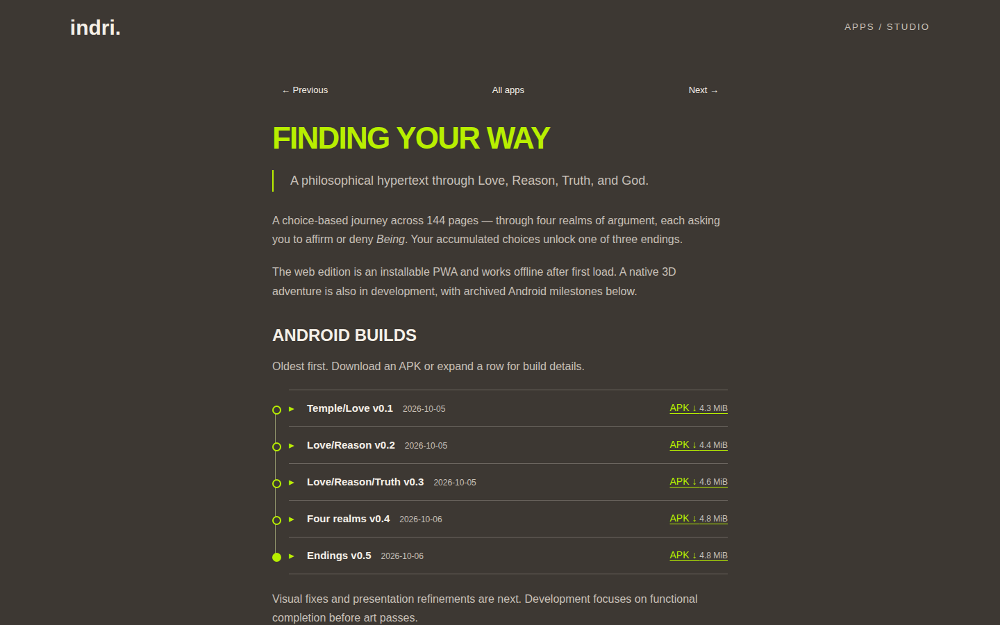
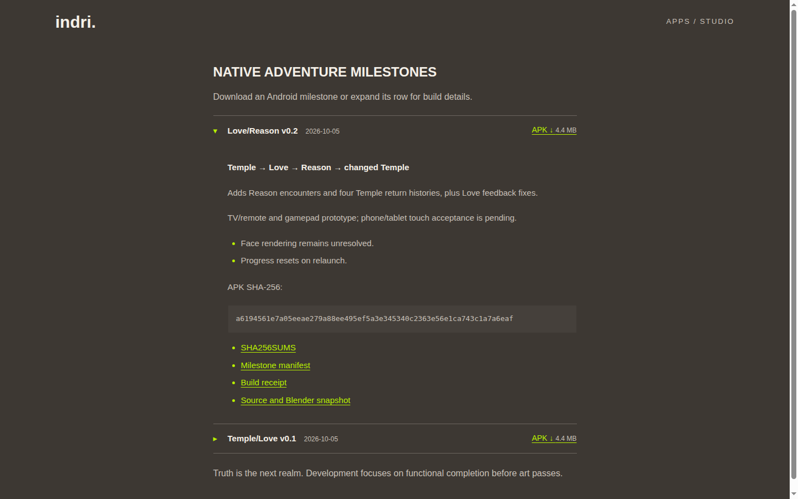
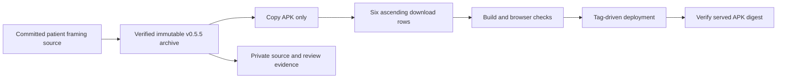
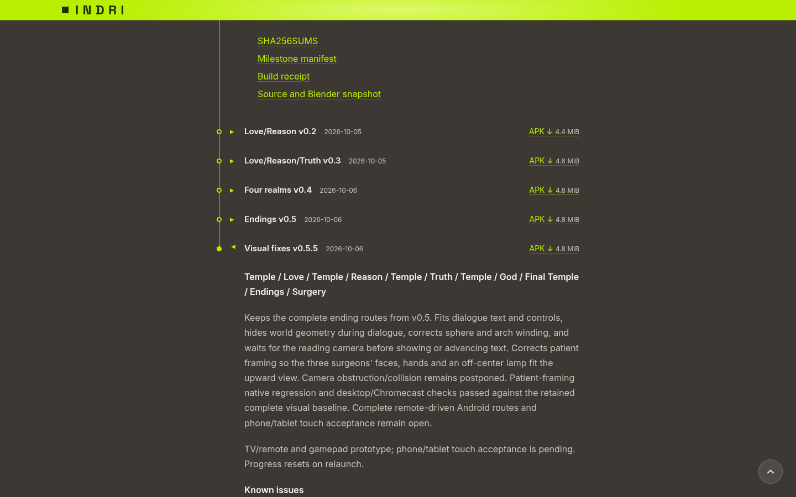
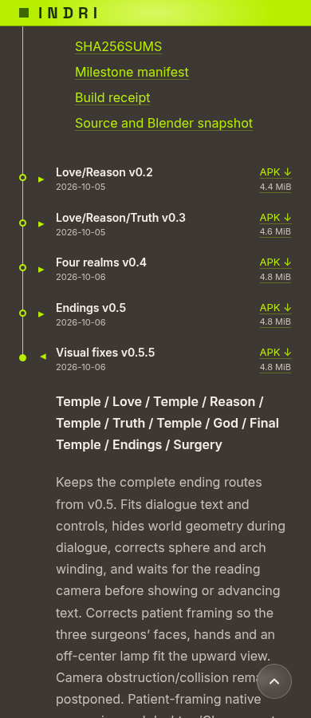

# Finding Your Way Android milestones

Publish the two archived Android milestones as compact expandable rows on `/apps/finding-your-way/`. Retain the original summary, journey description and four screenshots. Update the page and homepage gallery artwork with uppercase Greek pi, Π.

## Implementation

- [x] Add `FindingYourWayMilestones.astro`, with archive manifests, direct APK links and file sizes derived from the APK bytes.
- [x] Copy the Temple/Love v0.1 and Love/Reason v0.2 archives unchanged into `public/apps/finding-your-way/milestones/`.
- [x] Keep rows collapsed by default, with one desktop line and two mobile lines. Expand to show route, provenance, input limitations, known issues and checksums.
- [x] Add Π banner/icon artwork; preserve the screenshot gallery and use the branding artwork for the homepage card.
- [x] Static build and existing test suite pass; 11 tests, zero failures.
- [x] Browser checks pass at 1440 px and 390 px: summary heights 52 px and 55.5 px, direct downloads without disclosure toggling, keyboard operation, independent expansion, no horizontal overflow and all four screenshots present.
- [x] Both archive checksum sets pass; all ten files in the built site match the source archives byte for byte.
- [x] Published v0.1.161 (9c892ef); Cloudflare deployment succeeded. Live page is HTTP 200 and all ten archive files match the local archives byte for byte.

## Previews

[](2026-10-05-finding-your-way-milestones/desktop.html)

[](2026-10-05-finding-your-way-milestones/mobile.html)

[](2026-10-05-finding-your-way-milestones/archive-expanded.html)

The HTML files are illustrative mockups. [Actual browser checks](2026-10-05-finding-your-way-milestones/browser-checks.json) record implementation verification.

## Scope

Android distribution only. Phone touch and letterboxed tablet acceptance are future build work; these historical APKs are not rebuilt or relabelled as tablet-ready. Updated native launcher art is prepared in the Finding Your Way build generator for the next build. Web/PWA icon sources are updated in that repository. This release publishes the Indri catalogue page and artwork.

AI assistance: Codex. Exact model/version, tool version and reasoning effort were not available in verified session metadata and are not inferred.

## Published verification

[Live archive checksums and HTTP results](2026-10-05-finding-your-way-milestones/live-download-checks.json).

## Verification — PASS

1. Static build: PASS.

   ```text
   [build] 172 page(s) built in 15.73s
   [build] Complete!
   ```

2. Existing test suite: PASS.

   ```text
   # tests 11
   # pass 11
   # fail 0
   ```

3. Desktop/mobile browser behavior: PASS. Summary heights are 52 px and 55.5 px; direct download, keyboard operation, independent expansion, preserved screenshots and overflow checks all pass. Raw results are in `browser-checks.json`.

4. Live archive integrity: PASS.

   ```text
   PASS: live page contains both compact milestones and original journey text; all ten archive downloads match byte for byte.
   ```

5. GitHub release workflow: PASS. Run 37300649698 completed with conclusion `success`; Cloudflare deployment step succeeded.

## Versioned APK filenames

Both local and published APKs are now named `parmenides-v0.1-b7b49515f3998c85.apk` and `parmenides-v0.2-a6194561e7a05eea.apk`. The manifests, archive receipt paths, checksum lists and explicit HTML download filenames match. Original build paths are retained as provenance in the receipts. APK bytes and hashes are unchanged. Old asset filenames are removed, with no redirects or aliases.

Verification: PASS. Both updated archive checksum sets pass; the static build includes only the new APK filenames. Live browser download verification follows publication.

## Truth v0.3 and ascending timeline

- [x] Publish the tested Love/Reason/Truth v0.3 archive with versioned filename `parmenides-v0.3-a5e28d489566587a.apk`; preserve its original bytes, source checkpoint `20c4820e263ce8c27b507e6a562008eb681feda1`, source/Blender snapshot, verification evidence and signature report.
- [x] Sort milestones numerically by explicit version metadata, oldest first: v0.1 → v0.2 → v0.3.
- [x] Add a thin connecting timeline rail and hollow historical dots, with a filled final dot. Keep each row compact, its download visible and its native disclosure independently expandable.
- [x] Update desktop/mobile/expanded mockups; retain the existing introduction and four screenshots. God is the next realm.

Verification — PASS: Astro built 172 pages, all 11 existing tests passed, and archive checksums passed. Desktop/mobile browser checks confirm ascending order, 52px/55.5px compact rows, collapsed downloads, keyboard/independent expansion and no horizontal overflow. Full playthrough review and phone/tablet acceptance remain open.

## Four realms v0.4 — 2026-10-06

- [x] Add Four realms v0.4 after v0.3, with its actual 2026-10-06 archive date and versioned filename `parmenides-v0.4-7fd2a9d1655591d7.apk`.
- [x] Publish original APK bytes, source/Blender snapshot, test evidence, signature report, build receipt, manifest and checksums. APK SHA-256: `7fd2a9d1655591d79a036d37d81c4566ffc34778011d6bf0055a82de8132a069`.
- [x] Record chapter checkpoint `4c8c488` and engine checkpoint `1aecfbe`; describe God and the native texture-atlas fix accurately. Ending scenes remain previews, and phone/tablet acceptance remains pending.
- [x] Update all three mockups and next-step copy; derive displayed dates from archive metadata and expose verification/signature links when available.

Verification — PASS: all archive checksums pass; Astro builds 172 pages; all 11 existing tests pass. Desktop/mobile browser checks show four ascending rows with 52px/55.5px heights, collapsed downloads, independent keyboard disclosures, no overflow and all four original screenshots preserved. Live download verification follows publication.

## Endings v0.5 — 2026-10-06

- [x] Publish the fifth milestone, after v0.4, with actual version 5.0 and versioned filename `parmenides-v0.5-7f7ba37d62c0a7dd.apk`.
- [x] Preserve original APK, source/Blender snapshot, verification evidence, Android signatures, manifest, receipt and checksums; source checkpoint `a6363791128208bf740711d84521b9734e662fdd`.
- [x] Describe the Being, BOTH, NonBeing and surgery scenes, full source accounts, final-Temple review and known visual/input limits. Text clipping/occlusion fixes are deferred to v0.5.5; durable saves, art and phone/tablet acceptance remain open.
- [x] Update the compact ascending timeline, date, next-step copy and all three mockups.

Verification — PASS: all archive checksums match; the static site builds; all 11 existing tests pass. Desktop/mobile browser checks confirm five ascending rows, compact heights, collapsed downloads, keyboard/independent disclosures and all four original screenshots without overflow. Live download verification follows publication.

## Correct milestone numbering

Endings is v0.5; the visual-correction iteration is v0.5.5. The archive path, download filename, component labels, deferred-fix copy and mockups use these versions. APK bytes remain unchanged; `originalApkVersionName` records the intrinsic historical package label. No aliases or forwarding are added.

Verification — PASS: corrected archive checksums pass, the site builds, and the five-row mockups preserve ascending order, compact heights and no horizontal overflow.

## Withdraw v0.5.5 publication — 2026-10-06

- [x] Revert the sixth timeline entry, public v0.5.5 APK and six-row mockups at Will's request; restore the published timeline through Endings v0.5.
- [x] Retain the local frozen release archives and private evidence.
- [x] Publish the rollback using `task publish VERSION=v0.1.169`, commit `bf803a5`. Live verification passes: five ascending versions through v0.5 and withdrawn v0.5.5 APK URL returns 404.
- [x] Replacement v0.5.5 received: committed source `9b5d4f3`, frozen patient-framing archive and matching verification summary.

## Patient framing replacement v0.5.5 — 2026‑10‑06

Publish the tested replacement requested by Will. Only its APK is public; the source snapshot, receipts, diagnostics, screenshot catalog and author movie remain in the Finding Your Way project/archive. Retain the five historical rows and their files. The withdrawn earlier v0.5.5 remains withdrawn.



- [x] Receive archive `2026-10-06-patient-framing-v0.5.5`; SHA-256 `12116d8b40ce9fade6fc03850bbc4cc4709f8d6377dc2c6641490c1d5e418e75`. All archive checksums and 493 archived evidence files match.
- [x] Patient framing passed native/device review in both views and reduced motion. Three surgery catalog shots replaced, 100 retained with original provenance. Exact source/camera/scripts/unrelated geometry unchanged.
- [x] Published replacement as Visual fixes v0.5.5, website `627c02d` / `v0.1.170`. Corrected faces, hands and off-center lamp are described; general camera collision remains postponed.

### Verification — PASS

1. Run `task build` and the existing test suite.

   ```text
   [build] 172 page(s) built in 18.31s
   [build] Complete!
   # tests 11
   # pass 11
   # fail 0
   ```

   PASS.
2. Review six ascending rows on desktop/mobile: download visible while collapsed, correct filename, keyboard/independent disclosures, no overflow and existing gallery preserved. Check the replacement directory contains only the APK.

   ```text
   "width": 1440 / 390
   "collapsedDownload": true
   "keyboardAndIndependentDisclosure": true
   "noOverflow": true
   "galleryImages": 7
   "privateArchiveStatuses": {
     "manifest.json": 404, "source-snapshot.tar.gz": 404,
     "build-receipt.json": 404, "test-evidence.tar.gz": 404,
     "SHA256SUMS": 404, "signature-verification.txt": 404,
     "author-review-v0.5.5.mp4": 404
   }
   "passed": true
   ```

   PASS. Browser download filename and full APK SHA-256 match the immutable archive. [Full results](2026-10-05-finding-your-way-milestones/patient-framing-preview-browser-checks.json).

   [](2026-10-05-finding-your-way-milestones/patient-framing-preview-1440-expanded.png)

   [](2026-10-05-finding-your-way-milestones/patient-framing-preview-390-expanded.png)
3. Publish through `task publish`; verify the actual served APK checksum and that private archive files return 404.

   ```text
   publishing v0.1.170 on main (627c02d)
   tagged v0.1.170; deploy workflow triggered.
   HTTP/2 200
   content-type: application/vnd.android.package-archive
   content-length: 5043064
   12116d8b40ce9fade6fc03850bbc4cc4709f8d6377dc2c6641490c1d5e418e75
   "passed": true
   ```

   PASS. Deployment step succeeded. [Live browser evidence](2026-10-05-finding-your-way-milestones/patient-framing-live-browser-checks.json) verifies the actual versioned browser download and all seven private URLs returning 404. Full workflow post-deployment audit outcome is recorded separately when complete.


Evidence and actual page screenshots will be recorded in the existing co-named plan bundle. AI assistance: Codex; exact tool/model version and reasoning effort were unavailable in verified session metadata.


## Artwork v0.6 — 2026-10-07

Publish the exact archived iteration E APK as the seventh ascending milestone. The package retains its intrinsic version `0.6-endings-surgery.1`; the catalogue milestone is v0.6. Source snapshots, receipts and review evidence remain in the Finding Your Way archive.

- [x] Copy only `parmenides-v0.6-endings-surgery.1-ee82629373c95e6e.apk`, unchanged; SHA-256 `ee82629373c95e6e2a1e733a7e647bc52a4a653111d78172b2fffc802b6f8c6f`.
- [x] Describe A–E artwork, ending effects and surgery, with source checkpoint `b90655a`, 1,960 native checks and four TV tours. Disclose pending phone acceptance and framing/culling/performance limitations.
- [x] Update the roadmap: v0.7 polish and v0.8 optimization.
- [x] Verify build, existing tests and seven ascending download rows. Astro built 172 pages; all 11 tests passed. Desktop (1440px) and mobile (390px) browser checks passed: ordered rows, collapsed downloads, keyboard and independent disclosures, no page overflow, exact download filename and SHA-256. [Browser evidence](2026-10-05-finding-your-way-milestones/artwork-v06-preview-checks.json).
- [x] Publish via the established tag-driven deployment and verify the live APK digest. Published as website v0.1.171; live desktop/mobile downloads match the archived APK SHA-256. [Live browser evidence](2026-10-05-finding-your-way-milestones/artwork-v06-live-checks.json).


## Polish v0.7 — 2026-10-07

Publish the exact archived iteration F APK as the eighth ascending milestone. Keep all historical downloads, including v0.6, unchanged. Only the APK is public; source and review media remain private.

- [x] Copy `parmenides-v0.7-polish.2-ac1f33f51ff46a73.apk` unchanged; SHA-256 `ac1f33f51ff46a73889c65bf287cc16d4a39575e23643f478c23d0748dfe3a4a`.
- [x] Bind the release description to the verified F archive, full native/source checks, ten TV tours and exact launcher installation. Disclose phone, Android route, camera and performance limits.
- [x] Verify build, existing tests and eight ascending download rows at desktop/mobile widths.
- [x] Publish via the established tag-driven deployment; verify the actual live download digest.

AI assistance: Codex; exact model revision and reasoning-effort metadata were unavailable and are not inferred.

Local build and 11 existing tests pass. Preview verifies the exact APK digest, eight ascending rows, collapsed download, keyboard disclosure, independent expansion and no horizontal overflow at 1440 and 390 pixels. Evidence: `2026-10-05-finding-your-way-milestones/artwork-v07-preview/`.

Live v0.7 download SHA-256 matches the immutable archive at both 1440 and 390 pixels; all eight ascending rows, collapsed download, keyboard disclosure, independent expansion and page width checks pass. Evidence: `2026-10-05-finding-your-way-milestones/artwork-v07-live/`.
