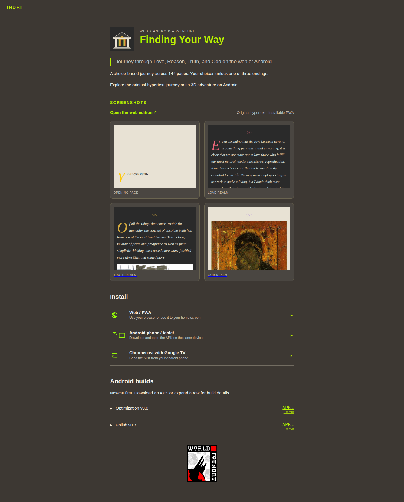
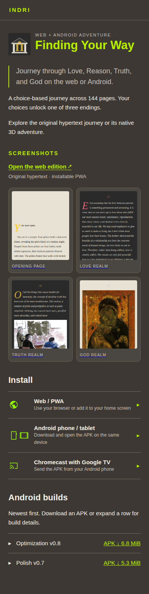

# Finding Your Way page layout

## Goal

Make the product page easy to scan: introduce the two editions without repeating the title in a large banner, show the web edition link immediately above the four screenshots, then present three consistent installation choices. Keep the release timeline layout, download links, APK bytes and milestone history intact.

## Layout contract

1. Use the existing small app icon beside the title. Keep the app identity and journey introduction, but make the summary describe both the web hypertext and Android 3D editions and remove repeated PWA copy. Use language suited to players throughout the public page.
2. Put **Open the web edition** in a clear link row directly between the “screenshots” label and the four images. The link goes to `https://d2cpue9r0hnyl3.cloudfront.net/` and identifies that edition as the original web/PWA journey.
3. Show the four screenshots as compact, equal-height previews in two columns at desktop and mobile sizes. Each preview links to its complete image for reading. Preserve all four images and captions.
4. Follow the gallery with an **Install** section containing three matching disclosure rows: **Web / PWA**, **Android phone / tablet**, and **Chromecast with Google TV**. Use the existing homepage icons at 24 px. Each row starts closed and expands to short, ordered instructions. The web link stays visible above the screenshots even while these rows are closed.
5. Follow the installation choices with **Android builds**, newest first. The phone and Chromecast steps point to these downloads. Preserve the current release timeline and its details. Keep the measured file size inside each APK download link, beneath **APK ↓** in a slightly smaller font at both desktop and mobile widths. End the section after the last release row; the extra status paragraph below it repeats release information and is out of date.
6. Use the site's design tokens. On desktop, keep the content within the existing 720 px article column; on mobile, let the rows fill the article width without horizontal scrolling. A disclosure row has the same structure and spacing on both viewports.

## Mockups

The mockups show the intended default state, with installation details closed. The HTML source is [responsive and inspectable](2026-10-09-finding-your-way-page-layout/mockup.html).

## Implementation

- [x] Simplify the hero to a small app icon, a title and a concise introduction covering both editions.
- [x] Reorder the app page to show the gallery, installation choices and Android builds after the introduction.
- [x] Add the web edition link directly above the four screenshot cards.
- [x] Use compact screenshot previews with direct links to the complete images.
- [x] Make Web/PWA, Android phone/tablet and Chromecast follow one disclosure pattern, using the existing platform icons and retaining their useful installation steps.
- [x] Show each APK's computed size as a smaller second line within its download link on both desktop and mobile; keep the release timeline layout and history.
- [x] Remove “native” from copy intended for players, including the introduction, installation links and release details; keep the Android and web distinction clear.
- [x] Remove the trailing “Artwork passes A–F…” status paragraph beneath the release timeline.
- [x] Verify the built page at 1440, 390 and 320 px widths: web link, four screenshots with full-image links, three keyboard-operated disclosure rows, all nine two-line APK links, expanded release details, no “native” in player-facing article text and no horizontal overflow. A separate app page retains its existing header.
- [x] Publish and verify the page layout as v0.1.180.
- [x] Publish and verify the inline APK-size refinement as v0.1.181.
- [x] Publish and verify the two-line APK-size and player-facing copy refinement as v0.1.182.
- [x] Publish and verify the release-note cleanup as v0.1.183.

## Notes

The web/PWA is the original hypertext edition. The APKs contain the 3D Android edition. The web link is hosted at the existing CloudFront address confirmed by Will; the Indri catalogue itself is served through Cloudflare.

AI assistance: Codex. Exact model/version, tool version and reasoning-effort metadata were not available in verified session metadata and are not inferred.
