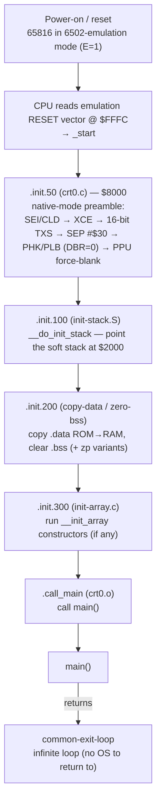

# SNES bootup sequence (the llvm-mos-65816 platform)

How a `snes` / `snes-far` ROM goes from power-on to `main()`. This is a **reference** for the existing
behavior; the *why* of the native-mode design lives in the plans linked at the end. Source of truth:
[`platforms/snes/crt0.c`](../platforms/snes/crt0.c), [`platforms/snes/link.ld`](../platforms/snes/link.ld),
[`platforms/snes/header.s`](../platforms/snes/header.s), and the common chain merged via
[`platforms/snes/CMakeLists.txt`](../platforms/snes/CMakeLists.txt).

## TL;DR

The 65816 powers on in **6502-emulation mode**, reads the **emulation RESET vector at `$FFFC`** → `_start`
(= the start of `.text` = `.init.50`). The crt0 preamble switches to **65816 native mode** and pins a known
machine contract (E/M/X/SP/DBR/DP), then the **common init chain** (`.init.100` → `.200` → `.300`) sets up the
soft stack, copies `.data`, clears `.bss`, and runs constructors, then `.call_main` calls `main()`. On the
SNES there is no OS to return to, so a return from `main()` lands in an infinite **exit loop**.

## The whole sequence at a glance



`.init.*` fragments are emitted into `.text` and ordered by their numeric suffix, so the **section number is
the boot order**. Unused fragments are garbage-collected (e.g. `hello.c` pulls in only `.init.50`, `.100`,
`.200`-zero-zp-bss, `.call_main` — no `.data` to copy, no constructors).

## Stage 0 — power-on and the reset vector

The 5A22 (the SNES's 65816) comes out of reset in **emulation mode (E=1)**, so it fetches the **emulation**
RESET vector at **`$FFFC`**. The linker points it at `_start`, which is the very first byte of `.text`:

```
$8000   _start = .                          ← .text base = reset entry
$8000   crt0.o:(.init.50)        0x18       ← native-mode preamble (this is _start)
$FFFC   SHORT(_start)                       ← emulation RESET vector
```

(LoROM maps ROM `$8000-$FFFF` to file offset `$0000-$7FFF`, so `$FFFC` is file offset `$7FFC`.)

## Stage 1 — `.init.50`: native-mode preamble ([`crt0.c`](../platforms/snes/crt0.c))

The 24-byte fragment that establishes the machine contract:

```asm
        .section .init.50, "axR", @progbits

        sei                 ; mask IRQ
        cld                 ; binary mode (decimal flag is undefined at reset)
        clc                 ; clear carry, then exchange it with E (next op):
        xce                 ; E = 0 -> 65816 native mode (M=1, X=1 kept)
        rep #$10            ; 16-bit index regs, so the next txs takes a 16-bit value
        ldx #$01ff          ; 16-bit immediate (an 8-bit txs would leave SP=$00FF)
        txs                 ; hardware stack pointer -> $01FF (page 1)
        sep #$30            ; M=1, X=1: 8-bit A + index (the codegen default)
        phk                 ; push program bank (= 0; reset code is in bank $00) ...
        plb                 ; ... pull it into DBR -> DBR := 0 (abs globals + MMIO read DBR:addr)
        lda #$00            ; A = $00 for the NMITIMEN store below
        sta $4200           ; NMITIMEN: no NMI / IRQ / auto-joypad
        lda #$8f            ; bit 7 = force-blank, brightness 0
        sta $2100           ; INIDISP: force blank, brightness 0
```

> crt0 is built with `-mcpu=mosw65816 -fno-lto` (set in `platforms/snes/CMakeLists.txt`), so the 65816-only
> ops are plain mnemonics. `-fno-lto` is required because module-level inline `asm()` under LTO does not
> receive the `W65816` subtarget feature; with it, `ldx #$01ff` assembles to the correct 16-bit immediate
> (`a2 ff 01`), byte-identical to the old hand-encoded `.byte` form.

### What actually executes (the linked bytes)

```
78  d8  18  fb  c2 10  a2 ff 01  9a  e2 30  4b  ab  a9 00  8d 00 42  a9 8f  8d 00 21
SEI CLD CLC XCE REP#10 LDX#$01ff TXS SEP#30 PHK PLB LDA#0 STA $4200 LDA#8F STA $2100
                └ X→16 └ 16-bit  │   └ M=1  │   │            └ NMITIMEN     └ INIDISP
                       SP value  │   X=1    │   └ DBR := 0     off          force-blank
                                 SP=$01FF   PB pushed (=0)
```

`dev/run.sh crt0native` asserts this byte sequence (and the runtime DBR=0) as a standing gate.

### The native-mode contract this leaves

| Register | Value after `.init.50` | How / why |
|---|---|---|
| **E** | 0 (native) | `XCE` — required for 16-bit accumulator/index codegen (`+mos-a16`/`+mos-xy16`) |
| **SP** | `$01FF` | page-1 hardware stack via a transient 16-bit `ldx #$01ff; txs` (an 8-bit `txs` would set `$00FF` and collide with the direct page) |
| **M** | 1 (8-bit A) | `SEP #$30` — the codegen default; 16-bit regions are bracketed by `rep/sep #$20` |
| **X** | 1 (8-bit index) | `SEP #$30`; 16-bit-index regions bracketed by `rep/sep #$10` (`+mos-xy16`) |
| **DBR** | 0 | `PHK; PLB` — explicit, so the 8-bit `abs`/`R_MOS_ADDR16` global path **and** the MMIO writes (which read `DBR:addr`) land in bank 0. Reset already leaves DBR=0; making it explicit means a later bank switch / `MVN`/`MVP` / interrupt can't silently break the invariant. The native-16 `long`/`R_MOS_ADDR24` path is DBR-independent. |
| **DP** | 0 | reset default; the direct page never moves on this platform (imaginary registers + zero page live at `$0000`) |
| **PPU** | force-blank, NMI/IRQ off | `INIDISP=$8F`, `NMITIMEN=$00` — a known display state with interrupts masked through bring-up |

## Stage 2 — the common init chain

Pulled in by [`CMakeLists.txt`](../platforms/snes/CMakeLists.txt)
(`merge_libraries(snes-crt0 common-copy-data common-init-stack common-zero-bss common-exit-loop)`), each piece
contributing a numbered `.init` fragment that runs after `.init.50`:

| Order | Fragment | Source | Does |
|---|---|---|---|
| `.init.100` | `__do_init_stack` | `common/crt0/init-stack.S` | point the **soft stack** at `__stack = $2000` (it grows **down** through low WRAM) |
| `.init.200` | copy `.data`, clear `.bss` | `copy-data.c`, `copy-zp-data.c`, `zero-bss.c`, `zero-zp-bss.c` | copy initialized `.data` from its ROM image (LMA) into RAM (VMA); zero `.bss` and the zero-page `.bss` |
| `.init.300` | `__init_array` | `init-array.c` | run C++ static constructors / `__attribute__((constructor))` (omitted if none) |
| — | `.call_main` | `crt0.o` | `jsr main` |

> The **soft stack** (the C call/local stack) is deliberately separate from the 65816 **hardware stack**
> ($0100-$01FF). Locals/spills use the soft stack via the `__rc0/__rc1` pointer; `JSR`/`RTS` return addresses
> use the hardware stack. This is why a page-1 hardware stack (`SP=$01FF`) is sufficient even in native mode.

## Stage 3 — `main()` and exit

`.call_main` calls `main()`. On a console there is no OS to return to, so `common-exit-loop` makes a return
from `main()` fall into an **infinite loop** (the program "ends" by spinning). Bring-up test ROMs typically
compute a `corpus_result` / `sentinel` global and then `for (;;) {}` so an emulator can settle and read the
value out of WRAM.

## Memory map at boot ([`link.ld`](../platforms/snes/link.ld))

```
$0000-$001F   imaginary (zero-page) registers __rc0..__rc31   (the GPR/Imag8/Imag16 file)
$0020-$00FF   zero page / direct page
$0100-$01FF   hardware stack (JSR/RTS, interrupts)            SP set to $01FF
$0200-$1FFF   low WRAM:  soft stack grows DOWN from $2000;    .data / .bss / heap grow UP from $0200
$2000-$7FFF   (bank $00) PPU/CPU MMIO, etc.                   $2100 INIDISP, $4200 NMITIMEN
$8000-$FFFF   cartridge ROM (LoROM): .text/.init, .rodata,    header @ $FFB0, vectors @ $FFE0-$FFFF
              .data LOAD image
```

`snes-far` adds a second ROM bank (`$018000-$01FFFF`) for cross-bank far **data**, read via DBR-independent
`long`/`[dp]` addressing; code stays in bank `$00`, so the boot sequence is identical (the crt0 is inherited
via `PARENT snes`).

## Interrupt & reset vectors ([`link.ld`](../platforms/snes/link.ld))

The 65816 has **two** vector tables — one used in native mode, one in emulation mode. The machine boots in
emulation mode (→ `$FFFC` RESET); after `XCE` any interrupt would use the native table, but interrupts stay
masked through bring-up (`SEI` + `NMITIMEN=0`), and both tables point NMI/IRQ at the same stubs.

```
Native ($FFE0-$FFEF):  $FFE6 BRK→irq   $FFEA NMI→nmi   $FFEE IRQ→irq   (COP/ABORT→0)
Emulation ($FFF0-$FFFF): $FFFA NMI→nmi  $FFFC RESET→_start  $FFFE IRQ→irq
```

The default handlers are **weak** bare-`rti` stubs ([`crt0.c`](../platforms/snes/crt0.c)), overridable by
defining `nmi` / `irq` in user code. A bare `rti` is width-safe (it restores `P`, hence M/X, on return).

> **For a future real handler (out of scope today):** a native-mode ISR can be entered with **M=0 and/or
> X=0** (it may interrupt a `rep #$30` region), so it must save `P` and force known widths before touching
> A/X/Y, and restore via `rti`. The current stubs sidestep this by doing nothing while interrupts are masked.

## Cartridge header ([`header.s`](../platforms/snes/header.s))

Not executed, but part of the boot image: the LoROM internal header at **`$FFB0-$FFDF`** (title `"LLVM-MOS
SNES"`, map mode `$20` = LoROM/slow, ROM size `$05` = 32 KiB, NTSC). The checksum/complement at `$FFDC/$FFDE`
are placeholders patched post-link by `tools/snes-checksum.py`.

## References

- Native-mode entry rationale + the 8-bit-safe argument:
  [`2026-06-14-321-native-mode-crt0.md`](plans/2026-06-14-321-native-mode-crt0.md).
- Explicit DBR=0 contract (the `phk; plb`) + the addressing/relocation analysis:
  [`2026-06-18-321-native-mode-crt0-xy16.md`](plans/2026-06-18-321-native-mode-crt0-xy16.md).
- Standing contract gate: `dev/run.sh crt0native` ([`dev/crt0native.sh`](../dev/crt0native.sh)).
- Build/test mechanics & the addressing/DBR note: [`agent-handoff.md`](agent-handoff.md).
